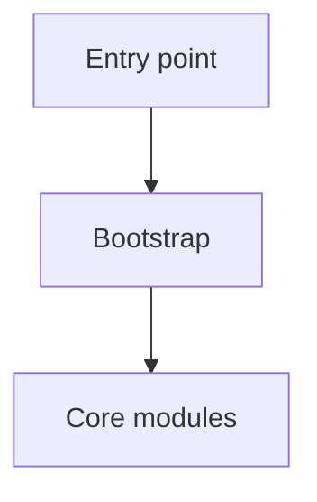
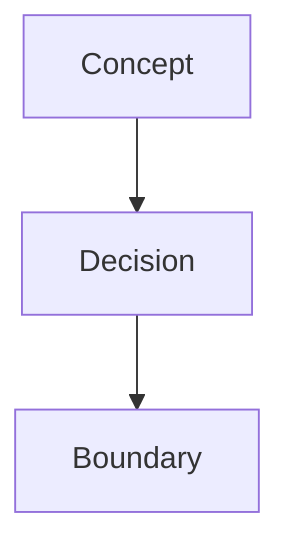

# Repo Memory Documentation Rule

Use this rule whenever `repo-memory` creates or updates repository knowledge.

## Directory Contract

Use `docs/` as the default knowledge directory. Detect `knowledge/` only for
backward compatibility:

- If `docs/` exists, use it.
- Else if `knowledge/` exists, keep using it unless the user wants migration.
- Else create `docs/`.

Required files for a newly initialized repository:

```text
docs/
├── .state.md
├── .todo.md
├── project-structure.md
└── <topic>.md

repo root/
├── AGENTS.md
└── CLAUDE.md -> AGENTS.md
```

### File Purposes

- `AGENTS.md`: repo-root routing document under 200 lines.
- `project-structure.md`: top-level layout, startup path, and ownership map.
- `.state.md`: last reviewed commit, iteration, covered areas, and open risks.
- `.todo.md`: prioritized memory backlog and unresolved questions.
- `<topic>.md`: domain or workflow knowledge organized by problem space.

## Quality Bar

Every knowledge document must:

- start with a Mermaid diagram, then explain the diagram in prose
- include at least one Mermaid diagram
- link critical files with relative repo paths and `#L` anchors when useful
- make its covered module, boundary, workflow, or invariant obvious
- stay concise and decision-oriented
- avoid copying function bodies, SQL internals, call-by-call traces, or local helper
  details unless they are essential to the invariant
- end with an update footer:
  `*Last updated: YYYY-MM-DD | Reason: <why this changed>*`

## Mermaid Guidance

Choose the simplest diagram that explains the memory:

- Business flow or request chain: `flowchart` or `sequenceDiagram`
- State transitions or lifecycle rules: `stateDiagram-v2`
- Architecture and module relationships: `graph TD`
- Class or interface relationships: `classDiagram`
- Cross-service timing or handoffs: `sequenceDiagram`

Keep node labels short. Split large flows into multiple diagrams. Highlight the
critical path instead of styling everything.

## Link Guidance

- Use repo-relative links such as `docs/order-lifecycle.md` or `src/server.ts#L1`.
- Prefer line anchors for source references when they are stable enough to help.
- Never use machine-local absolute paths.
- Never handwrite full Git hosting URLs.

## Initialization Steps

When initializing memory:

1. Inspect `README`, manifests, package/workspace files, entry points, and recent
   history.
2. Identify how the application starts or how the package is entered.
3. Separate code-derived facts from business intent that needs user confirmation.
4. Create `AGENTS.md`, `docs/project-structure.md`, `docs/.state.md`,
   `docs/.todo.md`, and at least one focused topic doc when a topic is known.
5. Create `CLAUDE.md -> AGENTS.md` only when safe.

## Incremental Update Steps

When updating existing memory:

1. Read `AGENTS.md` first.
2. Read the relevant docs before editing them.
3. Compare the current changes against the last reviewed commit in `.state.md`
   when available.
4. Update only affected docs.
5. Update `.state.md` and `.todo.md` when coverage or unknowns changed.

If code changed but the memory value filter finds nothing durable, do not force a
doc edit.

## Templates

### AGENTS.md

```markdown
# <Project Name>

<1-2 sentences: what this codebase does and who uses it>

## Knowledge Base

| Document | What it covers |
|----------|----------------|
| [docs/project-structure.md](docs/project-structure.md) | Top-level structure and how the app boots |
| [docs/<topic>.md](docs/<topic>.md) | <description> |

## Hard Constraints

- <constraint>

## Task Routing

- If you're modifying <domain X>, read [docs/<topic>.md](docs/<topic>.md) first.
```

### project-structure.md

````markdown
# Project Structure



<1 sentence: what this repo is and how it is organized>

## Directory Layout

```text
src/                    application code
scripts/                developer tooling
docs/                   repository memory
```

## Startup Path

- <how useful work begins>

## Key Files

- [src/main.ts#L1](../src/main.ts#L1) - entry point

---
*Last updated: YYYY-MM-DD | Reason: initial memory setup*
````

### Topic Doc

````markdown
# <Question this document answers>



<1-2 sentences of context>

## Key Rules

- <rule or invariant>
- <pitfall>

## Key Files

- [src/<path>.ts#L1](../src/<path>.ts#L1) - <why it matters>

## Open Questions

- TODO: <unknown that needs confirmation>

---
*Last updated: YYYY-MM-DD | Reason: <why this was written or updated>*
````

### .state.md

```markdown
# Memory State

- Last reviewed commit: `<sha>`
- Iteration: `1`
- Last run: `init`
- Covered areas: `<area>`, `<area>`
- Open risks: `<risk>`
```

### .todo.md

```markdown
# Memory TODO

- [ ] Trace refund lifecycle from API request to settlement job
- [ ] Confirm ownership boundary between billing and order state transitions
```
