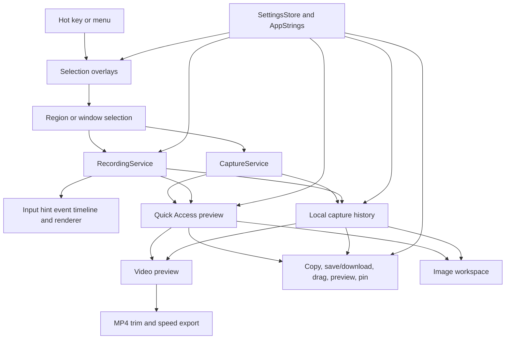

# Architecture

Frame is a native macOS menu bar app. AppKit owns the runtime because the product depends on system-level behavior: status items, global hotkeys, Screen Recording permission, full-screen overlay windows, ScreenCaptureKit recording, pasteboard access, and local file output.

## Targets

- `Frame`: executable entry point.
- `FrameApp`: AppKit adapters and user-facing capture flow.
- `FrameCore`: deterministic helpers that can be tested without AppKit.
- `FrameCoreTests`: unit tests for core behavior.
- `FrameAppTests`: AppKit component E2E tests for stable HUD and interaction behavior.

## Runtime Flow

See `DESIGN.md` for interface principles, including the native deep glass HUD,
white icon contrast, quiet HUD boundaries, and direct-manipulation capture
behavior.

1. `FrameApplication` starts `NSApplication` with accessory activation policy.
2. `AppDelegate` creates the menu bar item, hotkey controller, overlay controller, capture and recording services, active-screen resolver, preview controllers, and output writers. It rejects new capture shortcut entries while selection, recording countdown, active recording, paused recording, or recording finalization is already in progress.
3. `StatusItemController` exposes menu commands for screenshot, capture history, settings, and quit. While recording, it switches to a red recording icon and adds a stop-recording action.
4. `SettingsWindowController` hosts the SwiftUI settings window, including custom screenshot and recording shortcut recorders, screenshot save location, window screenshot style selection, local history controls, language selection, Screen Recording permission checks, and about/version details.
5. `SettingsStore` persists user-facing app settings in `UserDefaults`: screenshot and recording shortcut values, screenshot save directory, window screenshot style, local history preferences, recording options, OCR languages, and language preference.
6. `AppStrings` centralizes user-facing copy for Simplified Chinese and English. The language setting can follow the system language or force either supported language.
7. `HotKeyController` registers the selected screenshot and recording shortcuts through Carbon and routes them to separate screenshot and recording setup flows.
8. `ScreenRecordingPermission` checks and requests macOS Screen Recording access.
9. `SelectionOverlayController` creates one overlay per connected `NSScreen`, owns window candidate lookup, stores the last confirmed selection rectangle, and passes localized placeholder copy into overlay windows.
10. `SelectionOverlayWindow` shows a single active editable selection across displays, supports drag create/move/edge-resize/corner-resize interactions, can switch to an eligible double-clicked application window as a marked window selection, clears selection on empty double-clicks, and returns a global Cocoa screen rectangle after keyboard confirmation. Without a current selection, the active overlay shows a centered localized placeholder instead of a `0 x 0` HUD. Its fixed-width HUD includes numeric width/height editing, current-ratio locking, preset ratios, anchored ratio resizing, and temporary Shift ratio locking without changing the HUD width. The same HUD can switch into recording setup and active recording modes without closing the overlay. Delay screenshot countdowns snapshot the current selection, show a semi-transparent red countdown near the current screen's bottom center without a white outline, and make the overlay mouse-passive until capture completes.
11. `WindowCandidateProvider` adapts CoreGraphics window-list metadata into eligible ordinary application window candidates while excluding transient Frame overlay/HUD surfaces and obvious non-application surfaces. Ordinary Frame Settings and Capture History windows remain eligible for double-click window screenshots.
12. `CaptureService` converts the selected Cocoa rectangle into a Quartz capture rectangle and returns PNG data plus `NSImage`. Window captures pass through `WindowScreenshotDecorator` unless the selected window screenshot style is Original, which keeps the cropped window image raw.
13. `RecordingService` owns ScreenCaptureKit capture for one selected display region, hides Frame-owned HUD windows from output, honors the unified mouse hint setting for cursor visibility plus click highlights, records held-key keyboard hints through `RecordingOverlayEventStore` plus `RecordingOverlayRenderer`, writes MP4 or GIF through the encoder boundary, and exposes pause, resume, stop, and cancel through `RecordingSessionControlling`. Recording keyboard hints prefer a listen-only `CGEvent` tap so ordinary background key-down/key-up events such as letters, numbers, space, and fn can be tracked; this path depends on macOS Accessibility/Input Monitoring approval and falls back to `NSEvent` monitors when the event tap cannot be created.
14. `ActiveScreenResolver` resolves the active window rectangle, falling back to the mouse screen or main screen.
15. `QuickAccessPanelController` presents fixed-position screenshot and recording previews at the active screen's bottom-left corner, stacks mixed media cards upward with one shared card size, exposes localized icon-only hover actions, acts as the drag source for screenshot image content, and routes recording cards to download, copy, preview, edit, and close actions. Recording edit is enabled for MP4 and disabled for GIF. Recording start temporarily hides existing managed Quick Access cards and restores them before showing the completed recording card. A two-second hover opens a transient rounded right-side preview without an arrow; image and recording previews use aspect-fit scaling at the original media ratio, and recording previews play muted in that panel.
16. Recording thumbnails use the first decodable MP4 or GIF frame when available, otherwise Quick Access and Capture History show a lightweight video placeholder.
17. `VideoPreviewWindowController` opens a playable AVKit preview for local recording files. MP4 previews show the editor bar by default, allowing 0.01-second trim start/end changes and fixed speed presets from 0.5x through 8x. Preview playback is constrained to the selected trim range and pauses at the trim end. GIF previews stay preview/copy/download only. Copy and Download export the current dirty MP4 edit before output; Save Current asks whether to replace the current in-memory recording preview or create a new Quick Access preview. Closing a dirty MP4 preview asks for Replace Current, Save As New, Don't Save, or Cancel.
18. `ImageWorkspacePanelController` presents movable and resizable preview/edit workspace windows for preview sessions, plus separate image-only pinned windows. Preview/edit windows use native macOS close controls plus a top toolbar that leaves captured pixels unobstructed. The workspace hosts an `ImageAnnotationCanvasView` for object-based screenshot annotations, opens with pointer/select active, lays rectangle/oval/line/arrow shape tools out as direct toolbar buttons, and only keeps mosaic as a split tool whose main icon activates the current mosaic mode while the adjacent chevron opens Region/Brush mosaic options. Shift-constrained drawing turns rectangles/ovals into squares/circles and snaps lines/arrows to horizontal, vertical, or 45-degree angles. Color is a shared toolbar dropdown that shows the current color as its icon; the adjacent style dropdown is contextual, showing stroke Thickness for shape/brush/highlight and Font Size for text, with no text-specific tool dropdown. Toolbar menus mark the active option and remember the last selected color, thickness, font size, shape kind, and mosaic mode without changing the default pointer tool; Thickness offers 1, 2, 4, 8, 12, 16, and 24 px. Changing Font Size while a text annotation is selected updates that annotation immediately. Copy and download render the current edited screenshot and close both the preview/edit workspace and the originating Quick Access preview on success. Save Current opens Replace Current and Save As New actions; Replace Current updates the workspace's current edited screenshot and any still-active Quick Access preview in memory without overwriting external user files, while Save As New creates another Quick Access preview and keeps the workspace open. Closing a workspace with unsaved edits prompts for Replace Current, Save As New, Don't Save, or Cancel; Don't Save closes without calling save handlers, and Cancel keeps editing. Pinned windows expose copy, download, and edit through a context menu while keeping the pinned image open.
19. `ClipboardWriter` writes captured images or recording file URLs to `NSPasteboard`.
20. `ScreenshotFileWriter` and `RecordingFileWriter` save output files to the configured screenshot directory, defaulting to Desktop when no custom directory is stored.
21. `CaptureHistoryStore` writes recent captures to `Application Support/Frame/History`, stores metadata in a JSON index, enforces retention and size limits, and keeps these cached files separate from user-saved files.
22. `CaptureHistoryWindowController` lists recent local captures, uses first-frame thumbnails for recording tiles when available, and reuses copy, save, delete, and preview/open behavior for tile actions.

## Boundaries

`FrameCore` contains code that should stay independent from AppKit side effects:

- screenshot and recording shortcut defaults, validation, display formatting, storage migration, duplicate checks, and reserved-shortcut rules
- screenshot filename generation
- recording filename generation
- recording options and elapsed-time accounting
- deterministic video editing state, trim validation, speed presets, and output duration calculations
- Desktop save URL composition
- selection rectangle normalization and validation
- deterministic selection sizing, ratio fitting, and center-preserving rectangle adjustment
- selection capture metadata for region selections and window selections with window IDs
- window screenshot decoration style
- workspace close policy, selected editing tool state, and deterministic screenshot annotation document state

AppKit-specific code stays in `FrameApp`. Keep permission, capture, recording, pasteboard, panels, settings, localization, window metadata, and window behavior behind narrow adapters so future ScreenCaptureKit migration or UI changes are local.

## Current Tradeoffs

- `CaptureService` keeps capture platform calls isolated. Region captures still use `CGWindowListCreateImage` rectangular on-screen pixels. Window captures prefer ScreenCaptureKit single-window capture with shadow framing disabled, crop transparent or shadow-only margins, then either decorate the clean window image with the selected `Soft Backdrop`, `Canvas Glow`, or `Transparent Shadow` style or keep the cropped image raw when `Original` is selected. Window capture falls back to CoreGraphics with bounds framing ignored before using a region fallback.
- `RecordingService` is intentionally limited to one display per recording session. A full-screen recording is modeled as selecting the full screen on one display, not as a simultaneous multi-display recording.
- Selection overlay windows, recording HUDs, recording boundary overlays, and transient Frame panels opt out of system capture sharing so Frame controls are visible to the user but absent from screenshot or recording output. Mouse click highlights and held-key keyboard hints are output enhancements and are composited into recording frames instead of relying on capturing Frame control windows.
- Local development should use a stable self-signed Code Signing identity through `FRAME_CODESIGN_IDENTITY` to reduce TCC permission churn.
- Screen Recording permission is sensitive to bundle identity, path, and signature. Keep local testing on a stable app path such as `~/Applications/Frame.app`.
- Localization currently uses the code-level `AppStrings` boundary instead of `.strings` resources to keep SwiftPM packaging simple for v0.1. Keep callers on `AppStrings` so a future resource-backed migration stays local.
- Local history is a recovery cache, not the user's saved-file library. Its defaults are enabled, 7-day retention, and a 2 GB capacity limit. Cleanup deletes only Frame-owned cached files under Application Support.
- Screenshot and recording shortcut settings validate only local key/modifier shape, Frame-reserved shortcuts, and duplicates between Frame's two capture actions. Frame does not proactively inspect system-wide macOS or third-party shortcut conflicts; Carbon registration failure rolls back to the previous working shortcuts.
- Audio recording is reserved in the recording options model but not implemented yet.

---
*Last updated: 2026-06-17 | Reason: document MP4 recording editing pipeline and Original window screenshot output*
