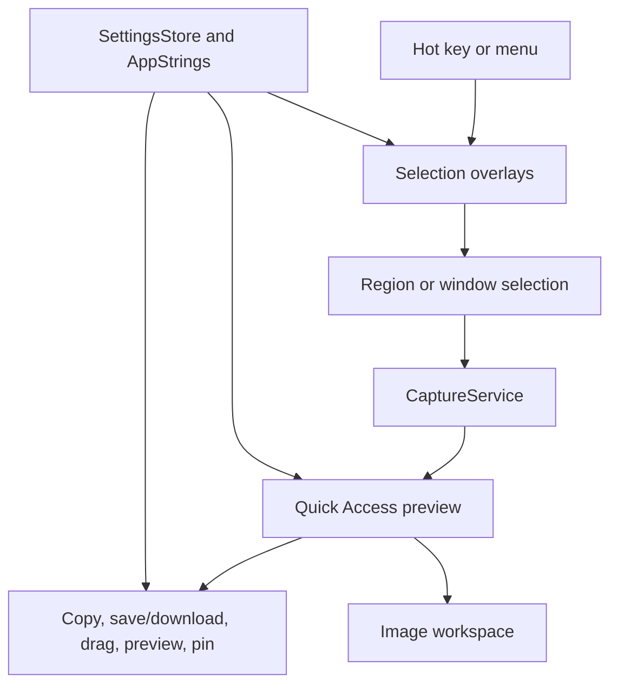

# Architecture

Frame is a native macOS menu bar app. AppKit owns the runtime because the product depends on system-level behavior: status items, global hotkeys, Screen Recording permission, full-screen overlay windows, pasteboard access, and local file output.

## Targets

- `Frame`: executable entry point.
- `FrameApp`: AppKit adapters and user-facing capture flow.
- `FrameCore`: deterministic helpers that can be tested without AppKit.
- `FrameCoreTests`: unit tests for core behavior.
- `FrameAppTests`: AppKit component E2E tests for stable HUD and interaction behavior.

## Runtime Flow

See `DESIGN.md` for interface principles, including the native glass HUD,
background-aware contrast, and direct-manipulation capture behavior.

1. `FrameApplication` starts `NSApplication` with accessory activation policy.
2. `AppDelegate` creates the menu bar item, hotkey controller, overlay controller, capture service, active-screen resolver, and output writers.
3. `StatusItemController` exposes menu commands for screenshot, settings, and quit.
4. `SettingsWindowController` hosts the SwiftUI settings window, including screenshot shortcut selection, screenshot save location, language selection, Screen Recording permission checks, and about/version details.
5. `SettingsStore` persists user-facing app settings in `UserDefaults`: shortcut, screenshot save directory, and language preference.
6. `AppStrings` centralizes user-facing copy for Simplified Chinese and English. The language setting can follow the system language or force either supported language.
7. `HotKeyController` registers the selected screenshot shortcut through Carbon and routes it to the screenshot flow.
8. `ScreenRecordingPermission` checks and requests macOS Screen Recording access.
9. `SelectionOverlayController` creates one overlay per connected `NSScreen`, owns window candidate lookup, stores the last confirmed selection rectangle, and passes localized placeholder copy into overlay windows.
10. `SelectionOverlayWindow` shows a single active editable selection across displays, supports drag create/move/edge-resize/corner-resize interactions, can switch to an eligible double-clicked application window as a marked window selection, clears selection on empty double-clicks, and returns a global Cocoa screen rectangle after keyboard confirmation. Without a current selection, the active overlay shows a centered localized placeholder instead of a `0 x 0` HUD. Its fixed-width HUD includes numeric width/height editing, current-ratio locking, preset ratios, anchored ratio resizing, and temporary Shift ratio locking without changing the HUD width.
11. `WindowCandidateProvider` adapts CoreGraphics window-list metadata into eligible ordinary application window candidates while excluding Frame's own windows and obvious non-application surfaces.
12. `CaptureService` converts the selected Cocoa rectangle into a Quartz capture rectangle and returns PNG data plus `NSImage`.
13. `ActiveScreenResolver` resolves the active window rectangle, falling back to the mouse screen or main screen.
14. `QuickAccessPanelController` presents fixed-position screenshot previews at the active screen's bottom-left corner, stacks multiple previews upward, exposes localized icon-only hover actions, and acts as the drag source for moving captured image content into compatible target apps.
15. `ImageWorkspacePanelController` presents movable and resizable preview/edit workspace windows for preview sessions, plus separate image-only pinned windows. Preview/edit windows use native macOS close controls plus a top toolbar that leaves captured pixels unobstructed. Copy and download close both the preview/edit workspace and the originating Quick Access preview on success; edited-image save remains disabled until editing ships. Pinned windows expose copy, download, and edit through a context menu while keeping the pinned image open.
16. `ClipboardWriter` writes the captured image to `NSPasteboard`.
17. `ScreenshotFileWriter` saves PNG data to the configured screenshot directory using `ScreenshotNaming`, defaulting to Desktop when no custom directory is stored.

## Boundaries

`FrameCore` contains code that should stay independent from AppKit side effects:

- shortcut defaults
- screenshot filename generation
- Desktop save URL composition
- selection rectangle normalization and validation
- deterministic selection sizing, ratio fitting, and center-preserving rectangle adjustment
- selection capture metadata for region selections and window selections with window IDs
- workspace close policy and selected editing tool state

AppKit-specific code stays in `FrameApp`. Keep permission, capture, pasteboard, panels, settings, localization, window metadata, and window behavior behind narrow adapters so future ScreenCaptureKit migration or UI changes are local.

## Current Tradeoffs

- `CaptureService` keeps capture platform calls isolated. Region captures still use `CGWindowListCreateImage` rectangular on-screen pixels. Window captures prefer ScreenCaptureKit single-window capture with shadow framing disabled, crop transparent or shadow-only margins, and fall back to CoreGraphics with bounds framing ignored before using a region fallback.
- Selection overlay windows opt out of system capture sharing so the dimming layer, selection outline, and HUD cannot be captured while the overlay is being dismissed.
- Local development should use a stable self-signed Code Signing identity through `FRAME_CODESIGN_IDENTITY` to reduce TCC permission churn.
- Screen Recording permission is sensitive to bundle identity, path, and signature. Keep local testing on a stable app path such as `~/Applications/Frame.app`.
- Localization currently uses the code-level `AppStrings` boundary instead of `.strings` resources to keep SwiftPM packaging simple for v0.1. Keep callers on `AppStrings` so a future resource-backed migration stays local.

---
*Last updated: 2026-05-28 | Reason: document local settings, localization, and capture placeholder behavior*
