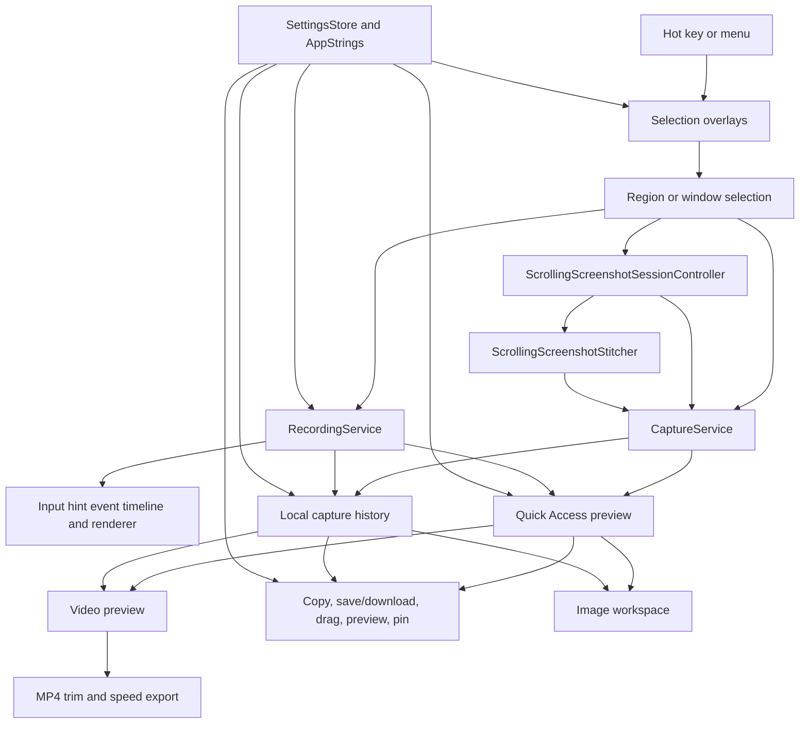

# Architecture

Frame is a native macOS menu bar app. AppKit owns the runtime because the product depends on system-level behavior: status items, global hotkeys, Screen Recording permission, full-screen overlay windows, ScreenCaptureKit recording, pasteboard access, and local file output.

## Targets

- `Frame`: executable entry point.
- `FrameApp`: AppKit adapters and user-facing capture flow.
- `FrameCore`: deterministic helpers that can be tested without AppKit.
- `FrameCoreTests`: unit tests for core behavior.
- `FrameAppTests`: AppKit component E2E tests for stable HUD and interaction behavior.

## Runtime Flow

See `DESIGN.md` for interface principles, including the native deep glass HUD,
white icon contrast, quiet HUD boundaries, and direct-manipulation capture
behavior.

1. `FrameApplication` starts `NSApplication` with accessory activation policy.
2. `AppDelegate` creates the menu bar item, hotkey controller, overlay controller, capture, scrolling screenshot, and recording services, active-screen resolver, preview controllers, and output writers. It rejects new capture shortcut entries while selection, scrolling screenshot, recording countdown, active recording, paused recording, or recording finalization is already in progress.
3. `StatusItemController` exposes menu commands for screenshot, capture history, settings, and quit. While recording, it switches to a red recording icon and adds a stop-recording action.
4. `SettingsWindowController` hosts the SwiftUI settings window, including custom screenshot and recording shortcut recorders, screenshot save location, window screenshot style selection, local history controls, language selection, Screen Recording permission checks, and about/version details.
5. `SettingsStore` persists user-facing app settings in `UserDefaults`: screenshot shortcut values, an optional recording shortcut, screenshot save directory, window screenshot style, remembered screenshot selection, local history preferences, recording options, OCR languages, and language preference. The recording shortcut defaults to unset, and the window screenshot style defaults to Original.
6. `AppStrings` centralizes user-facing copy for Simplified Chinese and English. The language setting can follow the system language or force either supported language.
7. `HotKeyController` registers the selected screenshot shortcut and, when configured, the recording shortcut through Carbon and routes them to separate screenshot and recording setup flows.
8. `ScreenRecordingPermission` checks and requests macOS Screen Recording access.
9. `SelectionOverlayController` creates one overlay per connected `NSScreen`, owns window candidate lookup, and persists the last confirmed screenshot selection for ten minutes. It restores region selections from their saved rectangle, and revalidates window IDs against the current global window list so an eligible remembered window can move or survive a Frame restart. It otherwise starts from an empty localized placeholder.
10. `SelectionOverlayWindow` shows a single active editable selection across displays, supports drag create/move/edge-resize/corner-resize interactions, and starts in an automatic window hover-preselection mode only when no remembered selection is restored and no user click or drag has occurred. In that mode, hovering an eligible application window marks it as a temporary window selection, moving over empty space clears it, clicking the suggested window fixes it as the active window selection, and dragging inside the suggested window starts a manual region selection from that point. It still supports double-clicking an eligible application window as an explicit marked window selection and clears selection on empty double-clicks. Without a current selection, the active overlay shows a centered localized placeholder instead of a `0 x 0` HUD. Its fixed-width HUD includes numeric width/height editing, current-ratio locking, preset ratios, anchored ratio resizing, and temporary Shift ratio locking without changing the HUD width. The same HUD can start vertical scrolling screenshots or switch into recording setup and active recording modes without closing the overlay. Delay screenshot countdowns snapshot the current selection, hide the selection HUD, show a semi-transparent red countdown near the current screen's bottom center without a white outline, and make the overlay mouse-passive until capture completes.
11. `WindowCandidateProvider` adapts CoreGraphics window-list metadata into eligible ordinary application window candidates while excluding transient Frame overlay/HUD surfaces and obvious non-application surfaces. Ordinary Frame Settings and Capture History windows remain eligible for window screenshots.
12. `CaptureService` converts the selected Cocoa rectangle into a Quartz capture rectangle and returns PNG data plus `NSImage`. Window captures pass through `WindowScreenshotDecorator` unless the selected window screenshot style is Original, which keeps the cropped window image raw.
13. `ScrollingScreenshotSessionController` owns manual-default vertical scrolling screenshot sessions. It presents Start, Finish, Cancel, and automatic scrolling assist controls, captures the fixed region while keeping the selected app scrollable, and serializes analysis so only one frame is in flight. `CaptureService` supplies raw scrolling frames without per-sample PNG encoding. `ScrollingScreenshotIncrementalPipeline` feeds the same accepted progress into a full-resolution accumulator and a width-bounded preview accumulator; the full accumulator owns one growing canvas, the previous accepted frame, bounded historical fingerprints, and a fixed memory limit instead of retaining every source screenshot. Background ingest and finalization work cross the MainActor boundary only through immutable Sendable inputs and nonisolated work builders, then publish results back on the MainActor. `ScrollingScreenshotStitcher` keeps overlap matching, no-motion detection, historical repetition, static top/bottom bands, and unreliable overlap as distinct decisions. Rejected frames do not mutate accepted output. `ScrollingScreenshotPreviewPanelController` shows the last accepted image in a fixed-height, non-activating side panel outside the selected pixels, centered horizontally with only an overlaid state dot. Automatic assist is a closed loop: it posts at most one scroll event, waits for the resulting frame classification, adapts the next displacement to confidence, confirms bottom after three no-motion samples, and stops immediately on a historical repeat or unreliable overlap. Finish and Cancel stay available after an interrupted sample. Finish closes the capture UI and encodes the already accepted full-resolution canvas to PNG once; it does not replay or restitch captured frames. The completed image enters Quick Access and history as a normal `CapturedScreenshot`.
14. `RecordingService` owns ScreenCaptureKit capture for one selected display region, hides Frame-owned HUD windows from output, honors the unified mouse hint setting for cursor visibility plus click highlights, records held-key keyboard hints through `RecordingOverlayEventStore` plus `RecordingOverlayRenderer`, writes MP4 or GIF through the encoder boundary, and exposes pause, resume, stop, and cancel through `RecordingSessionControlling`. Recording keyboard hints prefer a listen-only `CGEvent` tap so ordinary background key-down/key-up events such as letters, numbers, space, and fn can be tracked; this path depends on macOS Accessibility/Input Monitoring approval and falls back to `NSEvent` monitors when the event tap cannot be created.
15. `ActiveScreenResolver` resolves the active window rectangle, falling back to the mouse screen or main screen.
16. `QuickAccessPanelController` presents fixed-position screenshot and recording previews at the active screen's bottom-left corner, stacks mixed media cards upward with one shared card size, exposes localized icon-only hover actions, acts as the drag source for screenshot image content, and routes recording cards to a centered play preview affordance plus hover actions for download, copy, edit, and close. Recording edit is enabled for MP4 and disabled for GIF. Recording start temporarily hides existing managed Quick Access cards and restores them before showing the completed recording card. Its captured pixels remain unmodified; the hover action overlays, close/status/duration accessories, fallback placeholder, and two-second rounded right-side preview use shared deep HUD chrome. Image and recording hover previews use aspect-fit scaling at the original media ratio, and recording previews play muted in that panel.
17. Recording thumbnails use the first decodable MP4 or GIF frame when available, otherwise Quick Access and Capture History show a lightweight video placeholder.
18. `VideoPreviewWindowController` opens a playable AVKit preview for local recording files. MP4 previews hide native AVPlayer playback controls and the titlebar filename, place Save Current, Copy, and Download in a right-aligned, fixed-width output group aligned with the traffic-light titlebar controls like the screenshot editing workspace, and show Frame's compact grouped bottom editor/control bar by default. The header and editor use the shared deep HUD chrome; the editor remains a timeline workbench rather than a duplicated toolbar. The bar provides a mini timeline for progress seek, trim handles, and read-only 0.01-second start/end labels, with the labels placed inside wide selections, outside narrow selections when room allows, and clamped at crowded edges. The timeline strip and trim handles use a pointing-hand cursor. The bottom row stays limited to a circular play/pause control, current/selected duration summary, and fixed speed presets from 0.5x through 8x through a dropdown. Preview playback is constrained to the selected trim range and pauses at the trim end. GIF previews stay preview/copy/download only. Copy and Download export the current dirty MP4 edit before output; Save Current asks whether to replace the current in-memory recording preview or create a new Quick Access preview. Closing a dirty MP4 preview asks for Replace Current, Save As New, Don't Save, or Cancel.
19. `ImageWorkspacePanelController` presents movable and resizable preview/edit workspace windows for preview sessions, plus separate image-only pinned windows. Preview/edit windows use native macOS close controls plus a top toolbar that leaves captured pixels unobstructed. Its toolbar shares `FrameHUDChrome` with video and Quick Access control surfaces. Initial windows use the image's original display size when it fits inside the visible screen margin; larger images are reduced to fit. Extra-tall images that cannot preserve their aspect ratio without exceeding the screen instead use a screen-bounded viewport, open fitted to width, allow pinch-out down to the whole-image fit, and use two-finger scrolling to reach the remaining vertical content. Normal screenshots keep aspect-locked window resizing. Trackpad magnification zooms the image content inside both preview/edit and pinned windows without changing the window frame; after zooming, two-finger scroll pans the enlarged image within clamped bounds so the viewport can inspect other areas without showing blank space. The OCR text-selection overlay shares the same image zoom and pan state so hit targets stay aligned. The workspace hosts an `ImageAnnotationCanvasView` for object-based screenshot annotations, opens with pointer/select active, lays rectangle/oval/line/arrow shape tools out as direct toolbar buttons, and only keeps mosaic as a split tool whose main icon activates the current mosaic mode while the adjacent chevron opens Region/Brush mosaic options. Its contextual header control uses a chevron-free color swatch plus palette and a contextual size slider; text sizes reach 96 pt, and the image canvas backdrop stays opaque black. Copy and download render the current edited screenshot and close both the preview/edit workspace and the originating Quick Access preview on success. Save Current follows the configured default; Replace Current updates the workspace's current edited screenshot and any still-active Quick Access preview in memory without overwriting external user files, while Save As New creates another Quick Access preview and keeps the workspace open. Closing a workspace with unsaved edits offers Save, Don't Save, and Cancel for direct defaults, while Ask Every Time retains the explicit Replace Current / Save As New branch. Pinned windows expose copy, download, and edit through a context menu while keeping the pinned image open.
20. `ClipboardWriter` writes captured images or recording file URLs to `NSPasteboard`.
21. `ScreenshotFileWriter` and `RecordingFileWriter` save output files to the configured screenshot directory, defaulting to Desktop when no custom directory is stored.
22. `CaptureHistoryStore` writes recent captures to `Application Support/Frame/History`, stores metadata in a JSON index, enforces retention and size limits, and keeps these cached files separate from user-saved files.
23. `CaptureHistoryWindowController` lists recent local captures, uses first-frame thumbnails for recording tiles when available, and reuses copy, save, delete, and restore behavior for tile actions. Restoring screenshots or recordings routes them back into the bottom-left Quick Access stack; restored recordings derive their duration from the cached media file so MP4 edit controls have a valid source duration.

## Boundaries

`FrameCore` contains code that should stay independent from AppKit side effects:

- screenshot and recording shortcut defaults, validation, display formatting, storage migration, duplicate checks, and reserved-shortcut rules
- screenshot filename generation
- recording filename generation
- recording options and elapsed-time accounting
- deterministic video editing state, trim validation, speed presets, and output duration calculations
- Desktop save URL composition
- selection rectangle normalization and validation
- deterministic selection sizing, ratio fitting, and center-preserving rectangle adjustment
- selection capture metadata for region selections and window selections with window IDs
- deterministic scrolling screenshot overlap detection and vertical image stitching
- window screenshot decoration style
- workspace close policy, selected editing tool state, and deterministic screenshot annotation document state

AppKit-specific code stays in `FrameApp`. Keep permission, capture, recording, pasteboard, panels, settings, localization, window metadata, and window behavior behind narrow adapters so future ScreenCaptureKit migration or UI changes are local.

## Current Tradeoffs

- `CaptureService` keeps capture platform calls isolated. Region captures still use `CGWindowListCreateImage` rectangular on-screen pixels. Window captures prefer ScreenCaptureKit single-window capture with shadow framing disabled, crop transparent or shadow-only margins, then either decorate the clean window image with the selected `Soft Backdrop`, `Canvas Glow`, or `Transparent Shadow` style or keep the cropped image raw when `Original` is selected. Window capture falls back to CoreGraphics with bounds framing ignored before using a region fallback.
- Scrolling screenshots reuse the rectangular region capture path repeatedly. Manual scrolling is the default; optional automatic assist uses small generic scroll-wheel events rather than app-specific accessibility inspection, so it cannot reason about application-specific scroll containers. The incremental engine bounds retained state and rejects unreliable samples instead of corrupting the accepted canvas. A static footer is retained once, while repeated historical content stops automatic assist. Region capture remains behind `CaptureService` so its current CoreGraphics adapter can be migrated to ScreenCaptureKit without changing stitching or session control.
- `RecordingService` is intentionally limited to one display per recording session. A full-screen recording is modeled as selecting the full screen on one display, not as a simultaneous multi-display recording.
- Selection overlay windows, recording HUDs, recording boundary overlays, and transient Frame panels opt out of system capture sharing so Frame controls are visible to the user but absent from screenshot or recording output. Mouse click highlights and held-key keyboard hints are output enhancements and are composited into recording frames instead of relying on capturing Frame control windows.
- Local development should use a stable self-signed Code Signing identity through `FRAME_CODESIGN_IDENTITY` to reduce TCC permission churn.
- Screen Recording permission is sensitive to bundle identity, path, and signature. Keep local testing on a stable app path such as `~/Applications/Frame.app`.
- Localization currently uses the code-level `AppStrings` boundary instead of `.strings` resources to keep SwiftPM packaging simple for v0.1. Keep callers on `AppStrings` so a future resource-backed migration stays local.
- Local history is a recovery cache, not the user's saved-file library. Its defaults are enabled, 7-day retention, and a 2 GB capacity limit. Cleanup deletes only Frame-owned cached files under Application Support.
- Screenshot and recording shortcut settings validate only local key/modifier shape, Frame-reserved shortcuts, and duplicates between Frame's two capture actions. The recording shortcut can be unset, so Frame only registers it when a value is configured. Frame does not proactively inspect system-wide macOS or third-party shortcut conflicts; Carbon registration failure rolls back to the previous working shortcuts.
- Audio recording is reserved in the recording options model but not implemented yet.

---
*Last updated: 2026-07-21 | Reason: document the incremental scrolling engine and closed-loop automatic assist*
