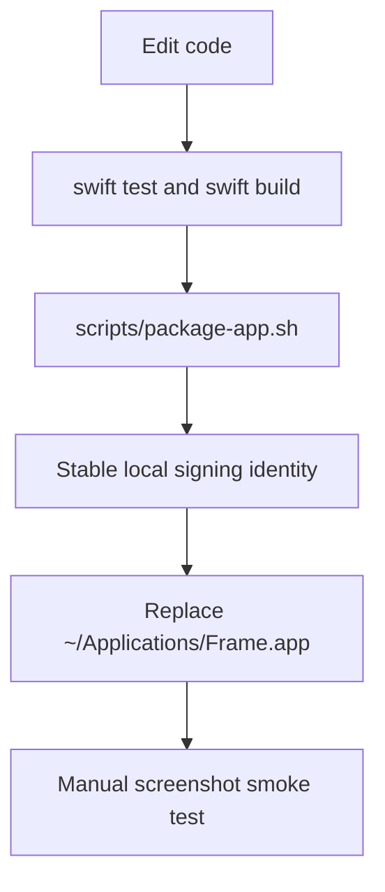

# Development



Frame development uses SwiftPM for verification, a local packaging script for app bundle creation, and a stable local signing path for repeat GUI testing without unnecessary Screen Recording permission churn.

## Requirements

- macOS
- Swift 6.2 toolchain
- Xcode command line tools

## Verify

Run these before merging or opening a PR:

```sh
swift test
swift build
scripts/package-app.sh
```

`scripts/package-app.sh` creates `.build/app/Frame.app`, writes `Info.plist`, copies the release executable, and signs the bundle. It uses ad-hoc signing by default so CI and fresh machines work without setup.

The packaging script also copies app resources from `Sources/FrameApp/Resources` into the app bundle. `Frame.icns` is written to `Contents/Resources` and referenced by `CFBundleIconFile`; menu bar PNG assets are copied so `StatusItemController` can load `FrameStatusIconTemplate` as a template image.

For stable local Screen Recording permission during development, sign with a stable local Code Signing identity:

```sh
export FRAME_CODESIGN_IDENTITY="Frame Local Dev CLI"
scripts/package-app.sh
```

Use this pattern for day-to-day development even when a real Apple certificate is available. The goal is to keep local TCC identity stable while avoiding accidental use of distribution credentials in debug builds. Use Apple Development or Developer ID identities only when intentionally testing those signing paths.

## Local Signing Identity Setup

Each development Mac should create one local self-signed Code Signing identity. It does not require an Apple Developer account and should not be used for public distribution.

The recommended identity name is:

```sh
Frame Local Dev CLI
```

### Keychain Access

Create the identity manually:

1. Open Keychain Access.
2. Choose `Certificate Assistant -> Create a Certificate...`.
3. Name it `Frame Local Dev CLI`.
4. Set `Identity Type` to `Self Signed Root`.
5. Set `Certificate Type` to `Code Signing`.
6. Check `Let me override defaults`.
7. Continue through the assistant and create the certificate in the login keychain.
8. Trust it for code signing if macOS does not list it as a valid signing identity.

### Command Line

If Keychain Access creates a certificate without a paired private key, generate and trust the identity from the command line:

```sh
tmpdir=$(mktemp -d)
cat > "$tmpdir/code-signing.cnf" <<'EOF'
[ req ]
default_bits = 2048
prompt = no
default_md = sha256
distinguished_name = dn
x509_extensions = codesign_ext

[ dn ]
CN = Frame Local Dev CLI
O = Frame Local Dev
C = CN

[ codesign_ext ]
basicConstraints = critical, CA:false
keyUsage = critical, digitalSignature
extendedKeyUsage = critical, codeSigning
subjectKeyIdentifier = hash
authorityKeyIdentifier = keyid,issuer
EOF

openssl req -x509 -newkey rsa:2048 -nodes -days 3650 \
  -keyout "$tmpdir/key.pem" \
  -out "$tmpdir/cert.pem" \
  -config "$tmpdir/code-signing.cnf"

openssl pkcs12 -export \
  -inkey "$tmpdir/key.pem" \
  -in "$tmpdir/cert.pem" \
  -name "Frame Local Dev CLI" \
  -out "$tmpdir/id.p12" \
  -passout pass:frame-local

security import "$tmpdir/id.p12" \
  -k "$HOME/Library/Keychains/login.keychain-db" \
  -P "frame-local" \
  -T /usr/bin/codesign \
  -T /usr/bin/security

security add-trusted-cert \
  -r trustRoot \
  -p codeSign \
  -k "$HOME/Library/Keychains/login.keychain-db" \
  "$tmpdir/cert.pem"

rm -rf "$tmpdir"
```

Verify the identity exists:

```sh
security find-identity -v -p codesigning
```

Expected output should include `Frame Local Dev CLI` and at least `1 valid identities found`.

## Manual Smoke Test

1. Build and package with the stable local signing identity:

   ```sh
   FRAME_CODESIGN_IDENTITY="Frame Local Dev CLI" scripts/package-app.sh
   ```

2. Replace the stable local app path for permission testing:

   ```sh
   mkdir -p ~/Applications
   rm -rf ~/Applications/Frame.app
   ditto .build/app/Frame.app ~/Applications/Frame.app
   open ~/Applications/Frame.app
   ```

Agents should use this stable-sign-and-replace flow whenever the user asks to run a local GUI build, replace the local app, or test screenshot behavior manually. Do not use a bare ad-hoc `scripts/package-app.sh` for repeated local GUI testing unless the task is specifically testing ad-hoc signing.

3. Grant Screen Recording permission when prompted.
4. Quit and reopen `~/Applications/Frame.app`.
5. Use `Frame -> 截图` or `Command+Shift+A`.
6. Confirm an initial selection appears immediately. The first run should select the main screen; later runs should reuse the last confirmed selection from the current app session.
7. Drag to create, move, or resize the region.
8. Press Enter to capture.
9. Confirm the `180x120` preview appears at the active screen's bottom-left corner with equal left and bottom padding.
10. With multiple displays, switch to another app on a different display and confirm visible previews move to that display's bottom-left corner.
11. Take multiple screenshots and confirm previews stack upward from the bottom-left corner.
12. Confirm the Quick Access preview cannot be moved by dragging its background.
13. Drag the preview image into a rich-text TextEdit document or Notes note and confirm the target receives image content.
14. Hover the preview and confirm icon-only save, copy, workspace, pin, and close actions appear.
15. Confirm copy places an image on the pasteboard.
16. Confirm save writes `Frame yyyy-MM-dd HH.mm.ss.png` to Desktop.
17. Confirm the workspace action opens a movable, resizable preview workspace.
18. Resize the workspace and confirm the image preview area preserves the captured image aspect ratio without empty fill.
19. Confirm switching focus to another app does not close the preview workspace.
20. Click the same Quick Access workspace action again and confirm it activates the existing preview workspace instead of opening a duplicate.
21. Confirm workspace Save is visible but disabled, while Copy and Download are enabled.
22. Confirm workspace Copy closes the workspace and the originating Quick Access preview on success.
23. Confirm workspace Download writes `Frame yyyy-MM-dd HH.mm.ss.png` to Desktop, then closes the workspace and originating Quick Access preview on success.
24. Confirm Escape closes the preview workspace.
25. Confirm pin closes the originating Quick Access card and opens a persistent image-only pinned window.
26. Confirm the pinned window has no toolbar or visible output buttons, keeps the image edge-to-edge, stays open after focus changes, and closes with the native red traffic-light close button.
27. Right-click the pinned window and confirm Copy and Download work without closing it.
28. Right-click the pinned window and confirm Edit opens or activates the preview/edit workspace without closing the pinned window.

Keep using the same `FRAME_CODESIGN_IDENTITY` and the same `~/Applications/Frame.app` path while iterating. Changing either one can make macOS ask for Screen Recording permission again.

## CI

GitHub Actions runs on macOS and verifies:

- AppKit component E2E with `swift test --filter HUDSizeControlTests`
- `swift test`
- `swift build`
- `scripts/package-app.sh`
- generated app bundle existence
- generated `Info.plist` validity
- generated app bundle signature metadata

CI does not grant Screen Recording permission or run full desktop GUI smoke tests. See `docs/testing.md` for the component E2E boundary and expectations for new interactive requirements.

## Local Permission Reset

When testing repeated local builds, reset the app permission entry:

```sh
tccutil reset ScreenCapture dev.dewey.frame
```

Then reopen the exact app bundle you want to authorize.

---
*Last updated: 2026-05-28 | Reason: document pinned window context menu smoke checks*
