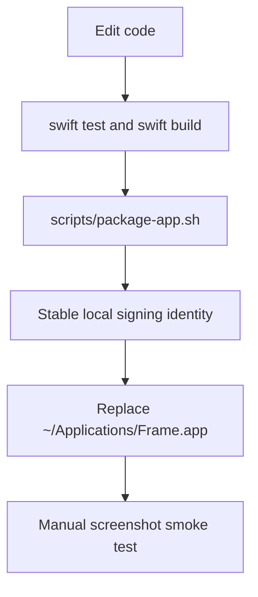

# Development



Frame development uses SwiftPM for verification, a local packaging script for app bundle creation, and a stable local signing path for repeat GUI testing without unnecessary Screen Recording permission churn.

## Requirements

- macOS
- Swift 6.2 toolchain
- Xcode command line tools

## Verify

Run these before merging or opening a PR:

```sh
swift test
swift build
scripts/package-app.sh
```

`scripts/package-app.sh` creates `.build/app/Frame.app`, writes `Info.plist`, copies the release executable, and signs the bundle. It uses ad-hoc signing by default so CI and fresh machines work without setup.

The packaging script also copies app resources from `Sources/FrameApp/Resources` into the app bundle. `Frame.icns` is written to `Contents/Resources` and referenced by `CFBundleIconFile`; menu bar PNG assets are copied so `StatusItemController` can load `FrameStatusIconTemplate` as a template image.

For stable local Screen Recording permission during development, sign with a stable local Code Signing identity:

```sh
export FRAME_CODESIGN_IDENTITY="Frame Local Dev CLI"
scripts/package-app.sh
```

Use this pattern for day-to-day development even when a real Apple certificate is available. The goal is to keep local TCC identity stable while avoiding accidental use of distribution credentials in debug builds. Use Apple Development or Developer ID identities only when intentionally testing those signing paths.

## Local Signing Identity Setup

Each development Mac should create one local self-signed Code Signing identity. It does not require an Apple Developer account and should not be used for public distribution.

The recommended identity name is:

```sh
Frame Local Dev CLI
```

### Keychain Access

Create the identity manually:

1. Open Keychain Access.
2. Choose `Certificate Assistant -> Create a Certificate...`.
3. Name it `Frame Local Dev CLI`.
4. Set `Identity Type` to `Self Signed Root`.
5. Set `Certificate Type` to `Code Signing`.
6. Check `Let me override defaults`.
7. Continue through the assistant and create the certificate in the login keychain.
8. Trust it for code signing if macOS does not list it as a valid signing identity.

### Command Line

If Keychain Access creates a certificate without a paired private key, generate and trust the identity from the command line:

```sh
tmpdir=$(mktemp -d)
cat > "$tmpdir/code-signing.cnf" <<'EOF'
[ req ]
default_bits = 2048
prompt = no
default_md = sha256
distinguished_name = dn
x509_extensions = codesign_ext

[ dn ]
CN = Frame Local Dev CLI
O = Frame Local Dev
C = CN

[ codesign_ext ]
basicConstraints = critical, CA:false
keyUsage = critical, digitalSignature
extendedKeyUsage = critical, codeSigning
subjectKeyIdentifier = hash
authorityKeyIdentifier = keyid,issuer
EOF

openssl req -x509 -newkey rsa:2048 -nodes -days 3650 \
  -keyout "$tmpdir/key.pem" \
  -out "$tmpdir/cert.pem" \
  -config "$tmpdir/code-signing.cnf"

openssl pkcs12 -export \
  -inkey "$tmpdir/key.pem" \
  -in "$tmpdir/cert.pem" \
  -name "Frame Local Dev CLI" \
  -out "$tmpdir/id.p12" \
  -passout pass:frame-local

security import "$tmpdir/id.p12" \
  -k "$HOME/Library/Keychains/login.keychain-db" \
  -P "frame-local" \
  -T /usr/bin/codesign \
  -T /usr/bin/security

security add-trusted-cert \
  -r trustRoot \
  -p codeSign \
  -k "$HOME/Library/Keychains/login.keychain-db" \
  "$tmpdir/cert.pem"

rm -rf "$tmpdir"
```

Verify the identity exists:

```sh
security find-identity -v -p codesigning
```

Expected output should include `Frame Local Dev CLI` and at least `1 valid identities found`.

## Manual Smoke Test

1. Build and package with the stable local signing identity:

   ```sh
   FRAME_CODESIGN_IDENTITY="Frame Local Dev CLI" scripts/package-app.sh
   ```

2. Replace the stable local app path for permission testing:

   ```sh
   mkdir -p ~/Applications
   rm -rf ~/Applications/Frame.app
   ditto .build/app/Frame.app ~/Applications/Frame.app
   open ~/Applications/Frame.app
   ```

Agents should use this stable-sign-and-replace flow whenever the user asks to run a local GUI build, replace the local app, or test screenshot behavior manually. Do not use a bare ad-hoc `scripts/package-app.sh` for repeated local GUI testing unless the task is specifically testing ad-hoc signing.

3. Grant Screen Recording permission when prompted.
4. Quit and reopen `~/Applications/Frame.app`.
5. Open `Frame -> 设置...` / `Frame -> Settings...`, then open it again from another display and confirm it centers on the current display.
6. Change the language between Follow System, 中文, and English. Confirm the menu, settings window labels, alerts opened after the change, Quick Access tooltips, and capture placeholder use the selected language.
7. In Settings, choose a custom screenshot save folder, quit and reopen Frame, and confirm the path persists.
8. In Settings, change Window screenshot style between Soft Backdrop, Canvas Glow, Transparent Shadow, and Original. Confirm the labels localize and the selected value persists after reopening Settings.
9. Reset the screenshot save folder and confirm it returns to Desktop.
10. Use the menu capture item or the configured keyboard shortcut.
11. On a fresh app session with no previous selection, confirm the active display shows a centered placeholder instead of a `0 x 0` HUD.
12. Drag to create, move, or resize the region.
13. Press Enter to capture.
14. Confirm the `180x120` preview appears at the active screen's bottom-left corner with equal left and bottom padding.
15. With multiple displays, switch to another app on a different display and confirm visible previews move to that display's bottom-left corner.
16. Take multiple screenshots and confirm previews stack upward from the bottom-left corner.
17. Confirm the Quick Access preview cannot be moved by dragging its background.
18. Drag the preview image into a rich-text TextEdit document or Notes note and confirm the target receives image content.
19. Hover the preview and confirm icon-only save, copy, workspace, pin, and close actions appear.
20. Confirm copy places an image on the pasteboard.
21. Confirm save writes `Frame yyyy-MM-dd HH.mm.ss.png` to the configured screenshot folder, or Desktop after reset.
22. Double-click an eligible app window, capture it, and confirm the output uses the selected window screenshot style. Confirm Original keeps the cropped raw window output without an added background canvas while region screenshots remain undecorated.
23. Confirm the workspace action opens a movable, resizable preview/edit workspace.
24. Resize the workspace and confirm the image preview area preserves the captured image aspect ratio without empty fill.
25. Confirm switching focus to another app does not close the preview/edit workspace.
26. Click the same Quick Access workspace action again and confirm it activates the existing preview/edit workspace instead of opening a duplicate.
27. Confirm the top toolbar shows Select, Rectangle, Oval, Line, Arrow, Brush, Text, Highlight, Mosaic, shared Color, the contextual Thickness/Font Size style menu, Save Current, Copy, and Download. The Select tool should be active by default; the Color button should show the currently selected color, menus should mark the active option, and the style menu should be disabled until a drawable tool is active. Change color, thickness, font size, shape, and mosaic mode, reopen the workspace, and confirm those choices are remembered while Select is still active by default.
28. Confirm Save Current is disabled before edits, while Copy and Download are enabled.
29. Click each editing tool's main icon and confirm it activates the tool without opening an option menu.
30. Confirm only Mosaic has an adjacent chevron dropdown, and that it contains Region/Brush mosaic modes. Shape, Brush, Text, and Highlight should not expose tool-option chevrons. Confirm Color is a standalone shared dropdown; selecting Shape, Brush, or Highlight should switch the style menu to Thickness with 1, 2, 4, 8, 12, 16, and 24 px stroke widths, while selecting Text should switch it to Font Size with font sizes.
31. Draw a rectangle, oval, line, arrow, brush stroke, highlight stroke, text label, rectangle mosaic, and brush mosaic; confirm the drawn content stays on the captured image. Hold Shift while drawing rectangle/oval and confirm square/circle output; hold Shift while drawing line/arrow and confirm horizontal, vertical, or 45-degree snapping. Rectangle mosaic should show only a selection frame while dragging and apply pixelation after release.
32. Select an edited object, move it, resize it from its resize handle, delete it, undo, and redo. Confirm Undo and Redo are disabled when their history stacks are empty.
33. Re-select a text label, edit the text, then change Font Size while the text is selected and confirm the selected text updates immediately.
34. Confirm Save Current becomes enabled after an edit and opens Replace Current / Save As New choices. Replace Current should update the current in-memory screenshot, refresh the still-visible Quick Access preview, clear the pending annotation selection, and keep the workspace open; Save As New should add another Quick Access preview and keep the workspace open without writing a local file directly.
35. Confirm workspace Copy includes rendered edits, then closes the workspace and the originating Quick Access preview on success.
36. Confirm workspace Download writes a rendered edited `Frame yyyy-MM-dd HH.mm.ss.png` to the configured screenshot folder, then closes the workspace and originating Quick Access preview on success.
37. Confirm Escape or the native close button asks whether to Replace Current, Save As New, Don't Save, or Cancel when unsaved edits exist. Replace Current and Save As New close after the chosen save action succeeds; Don't Save closes without creating or replacing a screenshot; Cancel leaves the workspace open with edits intact.
38. Confirm pin closes the originating Quick Access card and opens a persistent image-only pinned window.
39. Confirm the pinned window has no toolbar or visible output buttons, keeps the image edge-to-edge, stays open after focus changes, and closes with the native red traffic-light close button.
40. Right-click the pinned window and confirm Copy and Download work without closing it.
41. Right-click the pinned window and confirm Edit opens or activates the preview/edit workspace without closing the pinned window.
42. Use the screenshot shortcut again, draw a region, click the recording HUD button, and confirm the HUD switches into recording setup without closing the overlay.
43. Record a short MP4 with cursor enabled. Confirm start shows a brief preparation/loading state instead of a countdown, then switches to elapsed-time recording controls; stop finalizes the file, restart discards the current take and records the same area again, and delete requires confirmation before discarding without Quick Access.
44. Confirm the menu bar icon becomes a red recording dot while recording and its Stop Recording menu item stops the same active session.
45. Confirm the completed recording appears in a bottom-left Quick Access card with Download, Copy, Preview, disabled Edit, and Close.
46. Confirm Preview opens a playable video window and Edit remains disabled.
47. Confirm Copy places the recording file URL on the pasteboard and Download writes `Frame yyyy-MM-dd HH.mm.ss.mp4` to the configured screenshot folder.
48. Repeat with GIF selected and confirm `Frame yyyy-MM-dd HH.mm.ss.gif` output is produced.
49. Select an entire single display as the recording region and confirm the recording HUD remains usable but is absent from the output.
50. Confirm local capture history lists recordings separately, opens playable recording files, copies file URLs, saves files, and deletes cached recording records.

Keep using the same `FRAME_CODESIGN_IDENTITY` and the same `~/Applications/Frame.app` path while iterating. Changing either one can make macOS ask for Screen Recording permission again.

## CI

GitHub Actions runs on macOS and verifies:

- AppKit component E2E with `swift test --filter HUDSizeControlTests`
- `swift test`
- `swift build`
- `scripts/package-app.sh`
- generated app bundle existence
- generated `Info.plist` validity
- generated app bundle signature metadata

CI does not grant Screen Recording permission or run full desktop GUI smoke tests. Live ScreenCaptureKit recording, HUD exclusion from output, and full-screen selection recording must be verified through the stable local app smoke flow above. See `docs/testing.md` for the component E2E boundary and expectations for new interactive requirements.

## Local Permission Reset

When testing repeated local builds, reset the app permission entry:

```sh
tccutil reset ScreenCapture dev.dewey.frame
```

Then reopen the exact app bundle you want to authorize.

---
*Last updated: 2026-06-17 | Reason: add Original window screenshot smoke checks*
