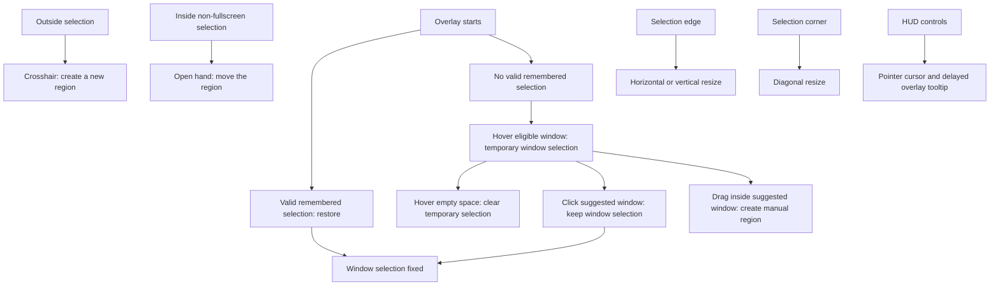

# Overlay Interactions

The screenshot overlay should make every drag affordance visible before the user
clicks. Cursor shape and drag behavior must stay aligned.

## Rules

- A confirmed screenshot selection is remembered in user preferences for ten
  minutes, including across Frame restarts. The next overlay revalidates a
  remembered window ID against the current global window list, while a
  remembered region restores its saved rectangle. Either restored selection
  skips hover preselection. A full-screen capture, expiration, or a missing
  remembered window clears the memory.
- Without a valid remembered selection, a new capture starts empty. While the user
  has not clicked or dragged, hovering an eligible app window temporarily
  selects that window; hovering empty space clears it.
- Clicking the suggested window exits automatic window preselection and keeps
  that window selected. Dragging inside the suggested window exits automatic
  mode and starts a manual region selection from that point instead of moving
  the suggested window rectangle.
- The temporary hover-selected window keeps the crosshair cursor until the user
  clicks to fix it as the active window selection. Move and resize cursors apply
  only after a selection is fixed or manually drawn.
- Outside the selection uses the crosshair cursor and starts a new region.
- Inside a non-fullscreen selection uses the move cursor and drags the selected
  region. Fullscreen selections keep crosshair behavior inside so users can draw
  a smaller region again.
- Four corners and four edge centers are visible white handles. Corners resize
  diagonally; edges resize one dimension.
- Locked-ratio or Shift resize applies to corners and edges. Edge resize keeps
  the dragged edge fixed on its axis and adjusts the other dimension from the
  selection center.
- HUD controls use pointer cursors. Overlay-owned tooltips are delayed and
  default below the control, falling back above only when needed.

## Key Files

- [Sources/FrameApp/SelectionOverlayWindow.swift](../Sources/FrameApp/SelectionOverlayWindow.swift) owns overlay hit-testing, cursor rectangles, resize behavior, handles, and HUD tooltip placement.
- [Sources/FrameApp/SelectionOverlayController.swift](../Sources/FrameApp/SelectionOverlayController.swift) owns the persisted ten-minute remembered selection lifecycle, region restoration, and window revalidation before overlays open.
- [Sources/FrameApp/HUDSizeControl.swift](../Sources/FrameApp/HUDSizeControl.swift) owns size HUD buttons, ratio menu state, and tooltip hover callbacks.

---
*Last updated: 2026-07-10 | Reason: document persistent region and window selection restoration*
