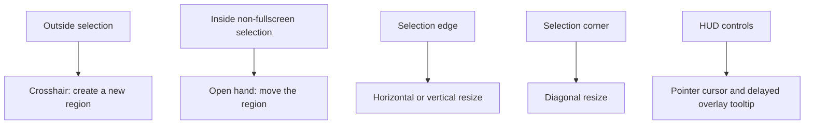

# Overlay Interactions

The screenshot overlay should make every drag affordance visible before the user
clicks. Cursor shape and drag behavior must stay aligned.

## Rules

- Outside the selection uses the crosshair cursor and starts a new region.
- Inside a non-fullscreen selection uses the move cursor and drags the selected
  region. Fullscreen selections keep crosshair behavior inside so users can draw
  a smaller region again.
- Four corners and four edge centers are visible white handles. Corners resize
  diagonally; edges resize one dimension.
- Locked-ratio or Shift resize applies to corners and edges. Edge resize keeps
  the dragged edge fixed on its axis and adjusts the other dimension from the
  selection center.
- HUD controls use pointer cursors. Overlay-owned tooltips are delayed and
  default below the control, falling back above only when needed.

## Key Files

- [Sources/FrameApp/SelectionOverlayWindow.swift](../Sources/FrameApp/SelectionOverlayWindow.swift) owns overlay hit-testing, cursor rectangles, resize behavior, handles, and HUD tooltip placement.
- [Sources/FrameApp/HUDSizeControl.swift](../Sources/FrameApp/HUDSizeControl.swift) owns size HUD buttons, ratio menu state, and tooltip hover callbacks.

---
*Last updated: 2026-05-26 | Reason: documented edge resize, cursor semantics, handles, and HUD tooltip behavior*
