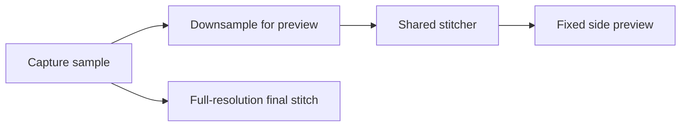

# Scrolling Screenshot Live Preview Implementation Plan

> Historical UI plan. The live runtime architecture is superseded by
> `2026-07-21-scrolling-screenshot-incremental-engine-plan.md`; the fixed-height
> side-preview requirements below remain valid.

## Goal

Add a fixed-size live preview beside an active scrolling screenshot selection so
users can see whether new content is being captured and stitched successfully.
The preview is feedback only; final full-resolution stitching remains the
authoritative completion path.

## Boundaries

- Keep deterministic stitching in `FrameCore` and AppKit panel/session lifecycle
  in `FrameApp`.
- Reuse `ScrollingScreenshotStitcher`; do not add a second overlap algorithm.
- Keep the preview non-activating, non-interactive, and excluded from captured
  window sharing.
- Do not add preview zoom, pan, resize, editing, or persistence.
- Preserve the current manual-first flow, automatic scrolling assist, Finish,
  Cancel, Quick Access, and history behavior.

## Tasks

1. Add AppKit component tests for fixed/compact preview sizing, side placement,
   mouse-event behavior, fixed-height rendering, status transitions, and
   cleanup.
2. Add session tests proving preview work is requested after samples, stale
   asynchronous updates are ignored, and preview failures do not replace the
   last known-good image.
3. Add a preview rendering seam that downsamples frames to at most `440 px` wide,
   runs the shared stitcher off the main actor, and skips intermediate PNG
   encoding.
4. Implement a fixed side panel with deep-glass chrome, an overlaid status dot,
   no status copy or pixel count, and a fixed-height, horizontally centered image
   surface.
5. Coalesce preview requests so only the newest sample set is rendered when an
   earlier request is still running.
6. Update the changelog and durable architecture/testing notes.
7. Run focused tests, `swift test`, `swift build`, and the stable-signing package
   flow. Replace `~/Applications/Frame.app`, launch it, and verify its signing
   authority.
8. Add a bounded recovery stitch that skips at most two isolated unmatched
   frames while still reaching one of the final two samples.
9. Keep the scrolling session alive while final stitching runs. On persistent
   failure, restore running capture with all samples intact instead of ending the
   session.
10. Surface the latest downsampled result as a disabled pending Quick Access card
    immediately after Finish, then upgrade that same card to the full-resolution
    screenshot on success or remove it when capture resumes after failure.
11. Close the capture boundary and session HUD immediately after Finish so the
    pending Quick Access card is the single finalization surface; restore the HUD
    only when persistent stitching failure resumes capture.
12. Hide the HUD panel during the Finish button action and defer destroying it
    until finalization completes, preventing AppKit window teardown from
    interrupting the button's stitch scheduling path.
13. Let preview stitching recover after one isolated interrupted sample while
    preserving conservative overlap thresholds.
14. Track completed preview height during automatic scrolling and disable the
    assist after two consecutive samples add no height, while leaving the
    capture session active for Finish or manual scrolling.

## Verification

- `swift test --filter ScrollingScreenshotSessionControllerTests`
- `swift test --filter ScrollingScreenshotStitcherTests`
- `swift test`
- `swift build`
- `FRAME_CODESIGN_IDENTITY="Frame Local Dev CLI" scripts/package-app.sh`
- Replace and launch `~/Applications/Frame.app`
- `codesign -dv --verbose=2 ~/Applications/Frame.app`

## Manual Smoke

- Select a browser region with room on the right and confirm the preview stays
  outside the selection and follows new content at the bottom.
- Repeat near the right screen edge and confirm left-side or compact placement.
- Confirm manual scrolling continues to reach the underlying app.
- Confirm the preview does not appear in the stitched output.
- Confirm Cancel closes the preview and Finish still produces the normal Quick
  Access result.
- Confirm automatic scrolling stops at the bottom without appending the page's
  starting section again.

## Key Files

- [`ScrollingScreenshotSessionController.swift`](../../../Sources/FrameApp/ScrollingScreenshotSessionController.swift#L1)
  owns sampling, preview request coalescing, and final stitching.
- [`ScrollingScreenshotPreviewPanelController.swift`](../../../Sources/FrameApp/ScrollingScreenshotPreviewPanelController.swift#L1)
  owns fixed-size panel placement and rendering.
- [`ScrollingScreenshotStitcher.swift`](../../../Sources/FrameCore/ScrollingScreenshotStitcher.swift#L1)
  remains the single overlap algorithm for preview and final output.

---
*Last updated: 2026-07-21 | Reason: recover interrupted previews and stop automatic scrolling at the bottom*
