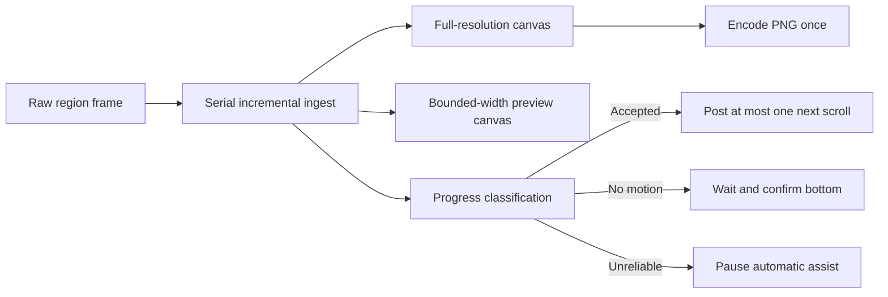

# Scrolling Screenshot Incremental Engine Plan

## Goal

Replace the live scrolling screenshot batch pipeline with a bounded-memory,
incremental engine. Keep the existing selection, HUD, fixed-height side preview,
pending Quick Access card, history, and output behavior.

## Delivery Boundaries

- Keep deterministic frame analysis and accepted-canvas state in `FrameCore`.
- Keep screen capture, scheduling, AppKit UI, Quick Access, and scroll-wheel side
  effects in `FrameApp`.
- Do not add DOM capture, browser extensions, Accessibility scroll-container
  discovery, horizontal capture, or third-party image dependencies.
- Keep the existing batch stitcher as a test/offline adapter until the new engine
  has equivalent deterministic coverage; the live path must not call it.
- Preserve current dirty work and avoid unrelated UI or naming cleanup.

## TDD Tasks

1. Add failing `FrameCoreTests` for incremental initialization, reliable append,
   no-motion classification, rejected-frame canvas preservation, historical
   repetition, static bottom bands, and resource limits.
2. Implement `ScrollingScreenshotAccumulator` by reusing the existing overlap
   candidate scorer and pixel thresholds.
3. Add failing `FrameAppTests` for raw-frame sampling, serial processing, Finish
   without restitching, one-scroll-at-a-time behavior, three-sample bottom
   confirmation, historical-repeat stopping, and unreliable-overlap pausing.
4. Add a raw scrolling-frame capture method that skips per-sample PNG encoding.
5. Add a serial processing pipeline with one full-resolution accumulator and one
   bounded-width preview accumulator. Release each source frame after ingestion.
6. Route the default scrolling session through the incremental pipeline. Preview
   updates come directly from accepted progress; Finish materializes the accepted
   canvas and encodes PNG once.
7. Replace preview-height-driven automatic scrolling with classification-driven
   control. After a scroll event, capture and classify before any next event.
8. Preserve manual fallback: rejected frames keep the last accepted preview and
   do not end the session; automatic scrolling pauses.
9. Update architecture, testing, README, Chinese README, and changelog language
   to describe incremental processing and reliable automatic stopping.
10. Build ingest and finalization worker closures from immutable Sendable inputs
    outside MainActor isolation, with a real detached-executor regression test.

## Verification

- `swift test --filter ScrollingScreenshotAccumulatorTests`
- `swift test --filter ScrollingScreenshotSessionControllerTests`
- `swift test --filter ScrollingScreenshotStitcherTests`
- `swift test`
- `swift build`
- `FRAME_CODESIGN_IDENTITY="Frame Local Dev CLI" scripts/package-app.sh`
- Replace and launch `~/Applications/Frame.app`
- `codesign -dv --verbose=2 ~/Applications/Frame.app`

## Manual Smoke

- Capture a long browser page manually and confirm the preview updates without a
  growing delay between samples.
- Finish after at least 20 accepted frames and confirm the HUD closes immediately
  and Quick Access becomes actionable without a second stitching pass.
- Enable automatic scrolling and confirm the page receives only one scroll event
  per accepted sample.
- Reach the bottom and confirm automatic scrolling stops without page bounce or
  returning to the first section.
- Introduce an animation or unmatched frame and confirm automatic scrolling
  pauses while the last good preview and Finish/Cancel remain available.
- Confirm the preview panel remains fixed-height and absent from captured pixels.

---
*Last updated: 2026-07-21 | Reason: implement approved incremental scrolling screenshot architecture*
