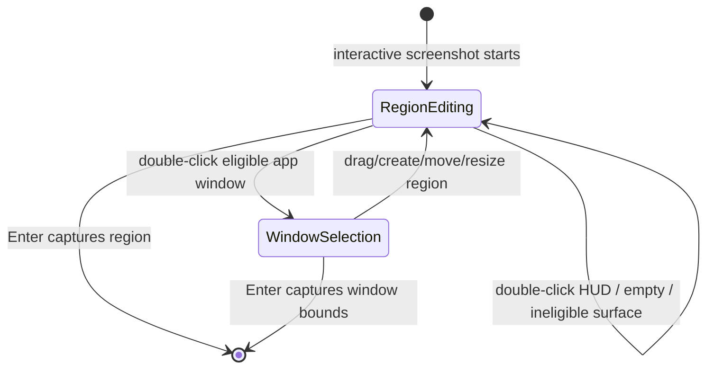

# Window Screenshot Design

## Goal

Frame should add a deliberate window screenshot path without losing the existing region screenshot loop. The screenshot shortcut should still show the previous region selection, while double-clicking a normal application window during the overlay switches the active selection to that window's bounds.

## Product Decisions

- Region screenshot remains the default interaction model.
- The last confirmed rectangle remains visible when an interactive screenshot starts.
- Window screenshot is triggered by double-clicking the overlay over an eligible application window.
- Automatic hover selection and a HUD window button are out of scope for this iteration.
- Double-clicking does not immediately capture. It updates the active selection to a marked window selection; Enter still confirms capture.
- Window selection is marked separately from region selection and carries the selected window ID so window captures can avoid macOS shadow ornamentation.
- Capturing a window uses the selected window ID and excludes window frame ornamentation such as the system shadow.

## Scope

This feature includes:

- Detecting ordinary application windows under the double-click point during the selection overlay.
- Switching the active selection to the matched window bounds.
- Returning selection metadata that distinguishes `.region` from `.window(id:)`.
- Preserving region screenshot editing and previous selection memory.
- Ignoring double-clicks on the HUD, empty desktop, system UI, Frame's own windows, tiny windows, invisible windows, and non-standard window layers where available metadata allows it.

This feature excludes:

- Automatic hover window selection.
- A visible window screenshot button.
- Window tracking across future app movement.
- Timer screenshot behavior.
- Rich annotation, OCR, history, cloud sync, scrolling capture, or recording.

## State Machine

## Interaction Rules

When the user triggers an interactive screenshot, Frame starts in `RegionEditing` and seeds the selection from the last confirmed rectangle if one exists.

Double-click handling:

- If the double-click is on the HUD, Frame ignores it.
- If the double-click is over no eligible window, Frame clears the current selection.
- If the double-click is over an eligible ordinary application window, Frame changes the active selection to that window's bounds and marks it as `.window(id:)`.
- Double-click works regardless of whether the point is inside or outside the previous region selection.
- Dragging, moving, or resizing a region clears any window candidate and returns the session to `.region`.
- Enter confirms the current active selection. Escape cancels the session.

## Window Eligibility

Frame should base window candidates on `CGWindowListCopyWindowInfo` metadata and keep filtering conservative:

- Exclude windows owned by the current Frame process.
- Prefer ordinary windows with `kCGWindowLayer == 0`.
- Exclude windows with missing or invalid bounds.
- Exclude tiny windows whose width or height is below the minimum candidate size.
- Exclude windows that are fully transparent or otherwise not shareable when the metadata exposes that.
- When multiple eligible windows contain the double-click point, choose the frontmost candidate from the system-provided window ordering.

The goal is to target normal application windows. System UI such as Stage Manager sidebars, menu bar surfaces, overlays, and Frame's own selection windows should not become candidates. If testing reveals a specific system surface still appears as eligible, the implementation can add a focused owner, layer, or bounds rule without promising universal semantic classification of all macOS UI.

## Capture And Memory

Window screenshot capture uses the selected `CGWindowID` rather than the same rectangular screen-pixel capture path as region screenshots. Frame requests the window image with bounds framing ignored so the saved output excludes macOS shadow ornamentation. The selected rectangle still comes from the candidate window's bounds in Frame's global Cocoa screen coordinate space for overlay display and next-selection memory.

After a successful window capture, Frame stores the captured window bounds as the last selected rectangle. The next interactive screenshot starts with that useful previous rectangle, but Frame does not try to remember or follow the original app window identity.

## Error Handling

- If Screen Recording permission is missing, Frame uses the existing permission prompt and does not start the overlay.
- If no eligible window is under the double-click point, Frame keeps the current region selection.
- If window metadata cannot be converted to a valid capture rectangle, Frame ignores that candidate.
- If capture fails after confirmation, Frame dismisses overlays and shows the existing capture failure alert.
- If the active selection is invalid when the user confirms, Frame beeps and keeps the overlay open.

## Testing Strategy

Unit tests cover deterministic core behavior:

- Selection metadata can mark a capture as `.region` or `.window(id:)`.
- Existing selection geometry tests continue to validate tiny or empty rectangles.

AppKit and CoreGraphics behavior should be verified with focused manual smoke tests:

- Start screenshot with a previous region and confirm it is still visible.
- Double-click a normal app window and confirm the active selection changes to that window bounds.
- Press Enter after window selection and confirm the captured image uses that window's full bounds.
- Capture a normal application window and confirm the saved PNG does not include the macOS window shadow.
- Double-click empty desktop or common system UI surfaces and confirm the current selection clears while the active screen keeps a centered HUD.
- Double-click the HUD and confirm the current selection remains unchanged.
- Drag or resize the region after a window selection and confirm the session returns to region selection.

## Acceptance Criteria

- Interactive screenshot still starts with the previous selection when one exists.
- Double-clicking an eligible ordinary application window updates the active selection to that window bounds.
- Double-clicking HUD does not disturb the current selection.
- Double-clicking empty space or ineligible surfaces clears the current selection and leaves a centered HUD on the active screen.
- Enter captures a marked window selection through the selected window ID without frame ornamentation such as shadows.
- Region editing remains available and clears the window selection.
- Selection results carry `.region` or `.window(id:)` metadata for specialized capture handling.

## Open Follow-Ups

- Decide whether to add a visible window mode button.
- Evaluate ScreenCaptureKit for true window-content capture without occlusion.
- Revisit system UI filtering after testing on macOS versions and Stage Manager configurations.
