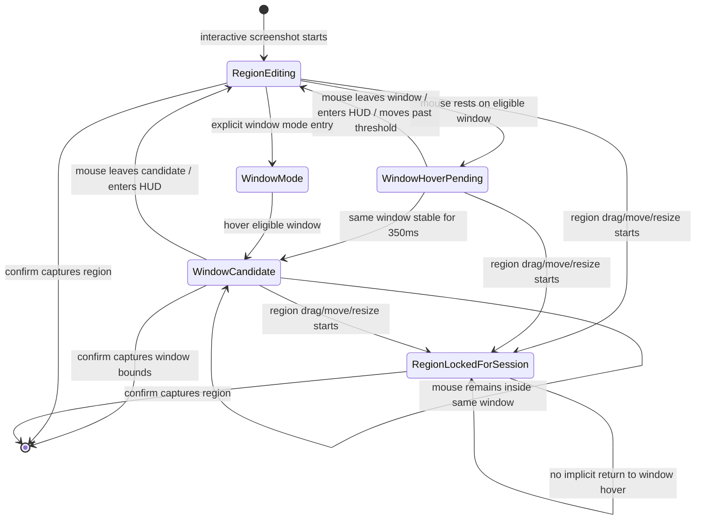

# Window Screenshot Design

## Goal

Frame should add a low-friction window screenshot path without losing the existing region screenshot loop. The default screenshot shortcut should still show the user's previous region, while also allowing the user to hover a normal application window and capture that window's bounds.

## Product Decisions

- Region screenshot remains the default interaction model.
- The last confirmed region remains visible when an interactive screenshot starts.
- Window screenshot has two independent entry points:
  - an explicit window mode entry point, intended for a HUD button or future menu/shortcut;
  - automatic window hover, intended as the default low-friction path.
- This version implements the interaction architecture so those entry points can be controlled independently later. A future settings surface can expose automatic hover enablement, hover delay, and explicit window mode visibility.
- Automatic hover uses a default activation delay of `350ms`.
- Timer-based or other non-interactive screenshot triggers do not enable automatic window hover.
- Capturing a window uses Frame's existing rectangular screen-pixel capture path. If another window visually covers the selected window, the obstruction appears in the screenshot.

## Scope

This feature includes:

- Detecting ordinary application windows under the mouse during the selection overlay.
- Showing a window candidate after the mouse is stable over the same eligible window for `350ms`.
- Capturing the candidate window's full bounds after explicit confirmation.
- Preserving region screenshot editing and the previous selection memory.
- Disabling automatic hover for the rest of the current screenshot session once the user starts editing a region.
- Excluding Frame's own windows, system UI, tiny windows, invisible windows, and non-standard window layers from automatic candidates where the available window metadata allows it.

This feature excludes:

- True window-content capture that removes occluding windows.
- Window tracking across future app movement.
- Timer screenshot behavior.
- User-facing settings UI for hover delay or mode toggles.
- Rich annotation, OCR, history, cloud sync, scrolling capture, or recording.

## State Machine

## Interaction Rules

When the user triggers an interactive screenshot, Frame starts in `RegionEditing` and seeds the selection from the last confirmed rectangle or the main screen fallback. Automatic window hover is allowed only while the user has not expressed region-editing intent in the current session.

Mouse movement starts or updates the automatic hover detector:

- If the mouse is over the HUD, no automatic hover timer runs.
- If the mouse is not over an eligible window, any pending hover timer is canceled.
- If the mouse moves to a different eligible window, the timer restarts for that new window.
- If the mouse remains inside the current window candidate, Frame does not repeatedly re-run the activation action.
- Small movement within the same eligible window can be tolerated so normal hand jitter does not prevent activation; larger movement restarts the timer.

Region interaction has priority over automatic hover. Once the user presses and drags to create, move, or resize a region, automatic hover is disabled for the rest of that screenshot session. After that point, confirmation captures the region. The user does not need an implicit way to return to automatic hover in the same session; they can restart the screenshot flow, and a future explicit window mode entry can provide a deliberate path if needed.

In `WindowCandidate`, confirmation captures the selected window bounds. In `RegionEditing` or `RegionLockedForSession`, confirmation captures the active region. Escape cancels the session.

## Window Eligibility

Frame should base window candidates on `CGWindowListCopyWindowInfo` metadata and keep the filtering conservative:

- Exclude windows owned by the current Frame process.
- Prefer ordinary windows with `kCGWindowLayer == 0`.
- Exclude windows with missing or invalid bounds.
- Exclude tiny windows whose width or height is below the minimum candidate size.
- Exclude windows that are fully transparent or otherwise not shareable when the metadata exposes that.
- When multiple eligible windows contain the mouse, choose the frontmost candidate from the system-provided window ordering.

The goal is to target normal application windows. System UI such as Stage Manager sidebars, menu bar surfaces, overlays, and Frame's own selection windows should not become automatic hover candidates. If testing reveals a specific system surface still appears as an eligible candidate, the implementation can add a focused owner, layer, or bounds rule without promising universal semantic classification of all macOS UI.

## Capture And Memory

Window screenshot capture uses the same rectangular capture service as region screenshots. The selected rectangle is the candidate window's bounds in Frame's global Cocoa screen coordinate space, converted by the existing capture adapter. This means the output represents visible screen pixels in that rectangle, including any occluding windows.

After a successful window capture, Frame stores the captured window bounds as `lastSelectedRect`. The next interactive screenshot therefore starts with a useful previous rectangle, but Frame does not try to remember or follow the original app window identity.

## Error Handling

- If Screen Recording permission is missing, Frame uses the existing permission prompt and does not start the overlay.
- If no eligible window is under the mouse, automatic hover stays inactive and the region selection remains available.
- If window metadata cannot be converted to a valid capture rectangle, Frame ignores that candidate rather than replacing the current region selection.
- If capture fails after confirmation, Frame dismisses overlays and shows the existing capture failure alert.
- If the active region is invalid when the user confirms, Frame beeps and keeps the overlay open.

## Testing Strategy

Unit tests should cover deterministic state and geometry behavior in `FrameCore` where possible:

- Hover activation only occurs after the configured delay for the same candidate.
- Moving to another candidate restarts activation timing.
- Entering HUD or losing an eligible candidate cancels pending activation.
- Region drag intent disables automatic hover for the current session.
- Re-selecting the already-active window candidate does not repeatedly activate it.
- Window candidate rectangles normalize and validate through the same selection geometry rules as region rectangles.

AppKit and CoreGraphics behavior should be verified with focused manual smoke tests:

- Start screenshot with a previous region and confirm it is still visible.
- Hover a normal app window without dragging and confirm the window candidate appears after roughly `350ms`.
- Press Enter while a window candidate is active and confirm the captured image uses that window's full bounds.
- Cover part of the target window with another window and confirm the obstruction appears in the screenshot.
- Move the mouse across windows and confirm timing restarts for each new target.
- Move the mouse over the HUD and confirm automatic hover does not trigger.
- Drag or resize the region and confirm automatic hover remains disabled for the rest of that session.
- Confirm Stage Manager/sidebar/system UI surfaces do not become candidates in common local setups.

## Acceptance Criteria

- Interactive screenshot still starts with the previous selection when one exists.
- Automatic window hover can select a normal application window without requiring the user to discard the previous selection.
- User region editing always wins over automatic hover for the current session.
- Window capture uses the candidate window bounds and the existing pixel capture path.
- Automatic hover does not run for non-interactive screenshot triggers.
- Window detection excludes Frame's own windows and obvious non-application surfaces.
- The implementation leaves clear internal configuration points for future settings around automatic hover and explicit window mode.

## Open Follow-Ups

- Add a settings UI for automatic hover enablement and hover delay.
- Decide whether to expose a persistent explicit window mode button in the HUD.
- Evaluate ScreenCaptureKit for true window-content capture without occlusion.
- Revisit system UI filtering after testing on macOS versions and Stage Manager configurations.

