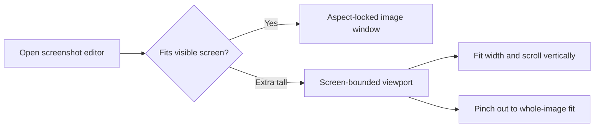

# Screenshot Editor Design

> Superseded in part by
> `docs/superpowers/specs/2026-07-09-image-editor-workflow-polish-design.md`
> for the contextual header style control, canvas tool shortcuts, double-click
> object context switching, and configurable Save Current default behavior.

## Goal

Ship Frame's first real screenshot editing workflow inside the existing Image Workspace. Users keep the current Quick Access-first capture loop, open the workspace when they want to edit, add annotations, update the current in-memory edited screenshot, or download a new PNG.

## Confirmed Product Decisions

- Quick Access remains the first post-capture surface. Editing starts from the existing workspace/open-preview action.
- "Replace original" means replacing Frame's current edited screenshot in memory, not overwriting any external user file.
- Download/Save As writes a new PNG to the configured screenshot folder.
- Editing is object-based: users can select annotations, move them, resize them, delete them, undo, and redo.
- Text objects can be re-edited after creation.
- Shape tools include rectangle, oval, line, and straight-edged filled wedge arrow.
- Holding Shift while drawing constrains rectangles/ovals to squares/circles and
  snaps lines/arrows to horizontal, vertical, or 45-degree angles.
- Mosaic supports both rectangular region mosaic and brush-style mosaic.
- The toolbar remains a single top row. Shape tools are flat top-level buttons
  for rectangle, oval, line, and arrow. Only mosaic uses a split button: clicking
  the main icon activates the current mosaic mode immediately, while the adjacent
  chevron opens Region/Brush mosaic options. The later 2026-07-09 workflow
  polish replaces the old separate Color and Thickness/Font Size toolbar menu
  buttons with a compact context-aware header style control for frequent color
  and size edits. Do not add a persistent side inspector or full property panel.
- The workspace opens with pointer/select active by default, while remembering
  the last selected color, thickness, font size, shape kind, and mosaic mode.
  The mosaic toolbar icon reflects the selected mosaic subtool.
- Extra-tall screenshots that would push the editor below the visible screen use
  a screen-bounded viewport instead of an oversized aspect-locked window. They
  open fitted to width, support two-finger vertical navigation, and can pinch out
  to the whole-image fit without resizing the window.

## Scope

This iteration includes:

- A deterministic annotation document model in `FrameCore`.
- Annotation styles with curated colors, line widths, font sizes, shape kinds, mosaic modes, a recommended mosaic block size, and mosaic strengths.
- Stroke Thickness offers 1, 2, 4, 8, 12, 16, and 24 px.
- A workspace editing canvas in `FrameApp` that draws the screenshot plus editable annotations.
- Tools for selection, rectangle, oval, line, arrow, brush, text, mosaic, and highlight.
- Shared toolbar dropdowns control annotation color plus a contextual style menu: stroke Thickness for shape/brush/highlight, and Font Size for text.
- Toolbar dropdowns mark the current choice, and the editor caches the last
  selected color, thickness, font size, shape kind, and mosaic mode between
  workspace openings.
- Mosaic is the only editing tool with a tool dropdown; its options are Region/Brush mode, and block size uses the recommended default instead of a custom UI.
- Rectangular mosaic drags show a lightweight selection rectangle first; the
  pixelated result is applied after mouse-up instead of being recomputed during
  the drag.
- Object selection, move, bottom-right resize, delete, undo, and redo.
- Text creation and double-click/re-enter editing.
- Double-clicking non-text annotations enters the matching editing context:
  shape subtypes select their matching shape tool, brush selects Brush,
  highlight selects Highlight, and mosaic selects Mosaic with the matching mode.
- Canvas tool shortcuts select editor tools while no inline text editor is
  active.
- Copy and Download use the current rendered edited image.
- Save Current follows the user's configured default. Ask Every Time opens a replace-or-save-new menu. Replace updates the workspace's current screenshot rendition and any still-active Quick Access preview without writing an external file; Save As New creates another Quick Access preview and keeps the workspace open without writing a local file directly.
- Closing the workspace with unsaved edits prompts for Save, Don't Save, or
  Cancel when a direct Save Current default is selected. Ask Every Time retains
  Replace Current / Save As New. Save choices close after they succeed; Don't
  Save closes without calling save handlers; Cancel keeps the workspace open
  with edits intact.
- Pinned image windows remain image-only; Edit opens the full editor workspace.

This iteration excludes:

- Overwriting user-saved files outside Frame.
- Persistent editable project files.
- Layer list UI, alignment guides, snapping, grouping, crop, blur, callouts, numbering, or freeform SVG export.
- Recording/video editing.

## Architecture

`FrameCore` owns the deterministic editing model:

- `ImageAnnotationDocument` stores annotations, selected element, active tool options, and undo/redo history.
- `ImageAnnotationElement` stores object geometry in image coordinates.
- `ImageAnnotationStyle` stores colors, line widths, font size, and mosaic settings.

`FrameApp` owns AppKit behavior:

- `ImageAnnotationCanvasView` draws the source image and annotations, maps mouse points to image coordinates, handles selection/create/move/resize/delete, and hosts temporary text editing fields.
- `ImageAnnotationRenderer` composites a current `CapturedScreenshot` plus an annotation document into a new PNG-backed `CapturedScreenshot`.
- `ImageWorkspacePanelController` owns toolbar dropdown menus, document state, canvas callbacks, Save Current, Copy, and Download.
- `AppDelegate.openWorkspace` passes output closures that accept the current rendered screenshot instead of always closing over the original capture.

The workspace should not recapture the screen. It edits the PNG/image already produced by `CaptureService`.

## UI Design

- Keep the existing top toolbar aligned with native traffic-light controls.
- Add a pointer/select button before editing tools.
- Keep icon-only controls with tooltips and accessibility labels.
- Tools with options use a compact split-button affordance: the main icon area
  selects the tool, and a small adjacent chevron opens the menu. `Select` remains
  a single button because it has no options.
- Save Current uses a checkmark-style action, stays enabled when edits exist,
  and executes the configured default behavior on primary click.
- Download writes a new PNG from the current edited rendition.
- Selected annotations use a thin high-contrast outline without a visible resize
  anchor; the top-right corner remains the resize target.
- Save Current, Copy, and Download are equal-sized controls in a compact output
  group. Copy and Download tooltips read Save and Copy and Save and Download.
- Text editing uses an inline native text field placed over the text object.

## Output Semantics

- Copy renders base screenshot plus unsaved annotations and writes that image to the clipboard.
- Replace Current renders base screenshot plus annotations, replaces the workspace's current screenshot, refreshes the still-active Quick Access preview, clears the annotation stack, and keeps the workspace open.
- Save As New renders base screenshot plus annotations into a new screenshot identity, creates another Quick Access preview, keeps the workspace open, and leaves the current workspace edits uncommitted.
- Download renders base screenshot plus annotations, writes a new PNG through the configured screenshot directory, and follows the existing temporary workspace close behavior on success.
- Pinned windows keep their existing context menu output behavior and do not expose editing chrome directly.

## Error Handling

- Rendering failure keeps the workspace open and leaves the annotation document unchanged.
- Copy/download failure keeps the workspace open and uses existing Quick Access failure alerts.
- Empty or cancelled text editing does not add a text object.
- Dragging outside the image bounds clamps editable points to the image bounds.

## Testing Strategy

- `FrameCoreTests` cover document defaults, style defaults, add/select/move/resize/delete, hit testing, undo/redo, tool option changes, and Save Current reset semantics.
- `FrameAppTests` cover renderer pixel changes, workspace toolbar enabled tools,
  split-button menu behavior, dropdown menu contents and active states, cached
  toolbar option restoration, Shift-constrained shape drawing, rectangular
  mosaic draft-vs-commit rendering, copy/download using rendered edited output,
  Replace Current updating the workspace current image without external save,
  Save As New creating a new Quick Access preview, and text editing/style
  re-entry.
- Manual smoke covers real mouse drawing, resizing handles, text editing, mosaic region/brush visual output, and saved PNG inspection.

## Key Files

- [ImageWorkspacePanelController.swift](../../../Sources/FrameApp/ImageWorkspacePanelController.swift#L111) owns screen-bounded workspace layout and resize policy.
- [ImageWorkspaceImageZoom.swift](../../../Sources/FrameApp/ImageWorkspaceImageZoom.swift#L4) owns content zoom and clamped navigation.
- [ImageWorkspacePanelControllerTests.swift](../../../Tests/FrameAppTests/ImageWorkspacePanelControllerTests.swift#L2134) covers initial sizing, zoom, scrolling, and long-image regressions.

## Acceptance Criteria

- Capturing a screenshot still first shows Quick Access.
- Opening the workspace shows enabled editing tools.
- Users can draw text, rectangle, oval, line, straight-edged filled wedge arrow, brush, highlight, rectangular mosaic, and brush mosaic.
- Holding Shift constrains drawn shapes and lines as expected.
- Users can select an annotation, move it, resize it, delete it, undo, and redo.
- Text can be edited again after creation, and selected text updates when Font Size changes.
- Only mosaic tool options live in a split-button dropdown menu on the top
  toolbar; clicking a main tool icon does not open the menu.
- Color and contextual style controls live in the compact context-aware header
  style control, not in each drawable tool menu. The control uses an icon-only
  color swatch without a visible chevron, a tiled icon-only color dropdown
  palette, and an icon-only contextual size slider.
  It shows Thickness for shape/brush/highlight and Font Size for text. Select,
  mosaic, and other contexts without color/size controls hide the control. Text
  sizes range from 12 through 96 pt.
  Thickness offers 1, 2, 4, 8, 12, 16, and 24 px.
- Dropdown menus mark the active option and restore the last selected color,
  thickness, font size, shape kind, and mosaic mode while still opening with the
  pointer/select tool active.
- Copy and Download output the rendered edited screenshot.
- Save Current follows the configured default and Ask Every Time offers Replace
  Current and Save As New choices.
- Closing with unsaved edits follows the Save Current preference: direct defaults
  offer Save, Don't Save, and Cancel, while Ask Every Time retains Replace
  Current / Save As New.
- Extra-tall screenshots remain inside the visible screen and allow users to
  reach the bottom through two-finger scrolling or view the whole image by
  pinching out.
- README English and Chinese product descriptions no longer say annotation tools are missing.

---
*Last updated: 2026-07-19 | Reason: define screen-bounded zoom and navigation for extra-tall screenshots*
