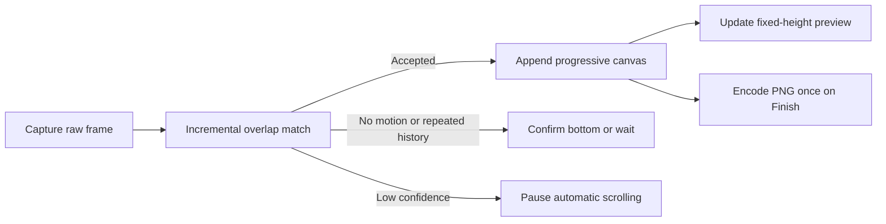

# Scrolling Screenshot Design

## Goal

Ship a reliable scrolling screenshot workflow for Frame. Users select a fixed
screen region, start a scrolling capture session, manually scroll or enable the
automatic assist, then finish the session to receive one stitched long PNG in
the existing Quick Access, history, copy, save, and editing flows.

The capture engine incrementally accepts or rejects each raw frame. Preview and
final output share that accepted canvas, so Finish never repeats the full stitch.
Manual scrolling remains the reliable fallback when generic automatic scrolling
cannot control a target app consistently.

## Confirmed Product Decisions

- The first version is manual scrolling by default, with an optional small-step
  automatic scrolling assist inside the session.
- The first version supports vertical scrolling only.
- The user starts from the existing screenshot selection overlay, chooses a new
  scrolling screenshot action, then scrolls the underlying content by hand.
- Frame does not try to identify or control the app's internal scroll view in
  this version.
- Frame does not need to identify the target app's internal scroll view. When
  the user enables automatic scrolling assist, Frame posts small generic scroll
  wheel events at the selected region center and keeps the user in control of
  finishing or cancelling.
- Frame keeps the selected rectangle fixed during capture. The user scrolls the
  content underneath that fixed rectangle.
- The active scrolling session exposes visible controls for Finish and Cancel.
  Finish finalizes the already accepted canvas as one screenshot. Cancel discards the
  session without showing Quick Access.
- While capture is running, Frame shows a fixed-size live preview beside the
  selected region. The preview follows the newest successfully stitched content
  so users can tell whether capture and overlap matching are progressing.
- Preview progress is produced incrementally from accepted frames. Frame must not
  restitch the complete frame history for each preview update.
- Finish uses the already accepted full-resolution canvas and performs PNG
  encoding once. It must not rerun overlap detection over all captured frames.
- Automatic scrolling is closed-loop: Frame posts one scroll event, waits for a
  captured frame to be classified, and only posts the next event after reliable
  progress. Low-confidence overlap pauses the assist without corrupting output.
- Bottom detection uses repeated high-confidence no-motion results after one
  scroll attempt, plus historical-frame repetition when available. Preview
  height alone is not an authoritative bottom signal.
- The output is a normal `CapturedScreenshot`, so it uses existing Quick Access,
  capture history, copy, save, image workspace, annotation, and pin behavior.
- Horizontal scrolling, bidirectional scrolling, full-page browser DOM capture,
  and app-specific scroll view introspection are reserved for later versions.

## Scope

This iteration includes:

- A scrolling screenshot action in the screenshot HUD.
- A scrolling capture mode that keeps the selected region visible but lets the
  underlying app receive mouse and keyboard input.
- Periodic sampling of the fixed selected region while the user scrolls.
- Deterministic incremental vertical stitching in `FrameCore`.
- Clear Finish and Cancel controls during the session.
- A fixed-size, non-activating live preview that reflects accepted stitching
  progress without overlapping the selected capture region.
- Failure handling for too few usable frames, no detected scroll progress, and
  image encoding failures, unreliable overlap, and bounded resource limits.
- Reuse of normal screenshot output surfaces after successful stitching.
- Unit tests for stitching and AppKit component tests for the HUD/session
  routing that do not require live Screen Recording permission.

This iteration excludes:

- Automatic scrolling as the default path.
- Horizontal scrolling.
- Capturing multiple displays in one scrolling screenshot.
- Capturing more than one selected region at a time.
- DOM-based full-page browser capture.
- Accessibility-based scroll view discovery.
- App-specific integrations for browsers, chat apps, editors, or PDFs.
- Background capture while another Frame capture or recording flow is active.
- An intermediate wait/resume control. The user chooses the range with Start and
  Finish instead.
- Preview zooming, panning, editing, or resizing. The live preview is capture
  feedback, not an intermediate image workspace.

## User Flow

1. The user triggers Frame's screenshot shortcut or menu action.
2. The user draws or adjusts a rectangular selection over scrollable content.
3. The screenshot HUD shows a scrolling screenshot action beside the existing
   screenshot actions.
4. The user clicks the scrolling screenshot action.
5. Frame dismisses or passivates the interactive selection overlay enough that
   the underlying app can receive scrolling input, while keeping a lightweight
   visible boundary around the fixed capture region.
6. Frame shows a compact scrolling session HUD near the selection. The HUD
   exposes Finish, Cancel, and an automatic scrolling assist toggle.
7. Frame periodically captures the same fixed region as raw pixels while keeping
   the boundary, compact session HUD, and a fixed-size side preview visible.
8. The user scrolls the content manually with a mouse, trackpad, keyboard, or
   app-specific scroll controls. If desired, the user can enable automatic
   scrolling assist; it scrolls with small steps close to manual scrolling and
   does not change the selected capture region.
9. Each reliable incremental addition updates the side preview. Rejected or
   duplicate frames do not change the accepted canvas. The preview keeps
   its dimensions stable, scales the full stitched result to the available
   height, and centers it horizontally.
10. The user clicks Finish when enough content has been captured.
11. Frame encodes the accepted full-resolution canvas once, stores the result in
    capture history, restores any temporarily hidden Quick Access previews, and
    shows the image as a normal screenshot card.
12. If the user clicks Cancel, Frame closes the boundary, HUD, and live preview,
    restores temporarily hidden Quick Access previews, and does not create output.

## Interaction Design

The scrolling session should feel like the recording boundary flow rather than a
new modal editor.

- Use the existing screenshot selection visual language: dim outside the region
  before start, then keep a visible non-interactive boundary once capture starts.
- The boundary must not block the app underneath from receiving scroll input.
- The session HUD should be compact, icon-first, and styled with the existing
  HUD chrome.
- Finish is the primary action because it creates the long screenshot.
- Automatic scrolling assist is secondary. It can be toggled while the session
  is running, but Finish and Cancel remain the reliable control surfaces.
- Cancel discards the session immediately after user intent is clear. If the
  implementation needs confirmation later, it should be HUD-local rather than a
  blocking modal alert.
- Escape cancels the active scrolling session when focus is still owned by
  Frame; the visible Cancel control remains the reliable surface.
- The session should not auto-finish on scroll inactivity in this version. Some
  pages pause for lazy loading, animations, or user reading time, so user intent
  is safer than inactivity inference.
- Frame shows an in-progress stitched preview in a fixed `220 x 320 pt` box. It
  prefers the side of the selection with more available screen space and never
  overlaps the selected capture region. When neither side has enough room, it
  uses a compact `160 x 240 pt` box on the side with more space. If even the
  compact box cannot fit outside the selection, Frame omits the preview rather
  than covering captured pixels.
- The preview is a non-activating, non-interactive panel with window sharing
  disabled. It must not steal focus, receive scroll events, or appear in the
  captured pixels.
- Preview content scales the full stitched result to the available height and
  stays horizontally centered. Its visible width narrows as the screenshot grows
  taller, while the box itself never changes size.
- A small overlaid status dot distinguishes waiting for the first sample,
  successfully accepted progress, no newly detected content, and unreliable
  overlap. The preview does not show status copy or pixel-height numbers. A
  failed update preserves the last known-good image instead of displaying a
  credible but broken partial result.
- Frame keeps one full-resolution incremental accumulator and one bounded-width
  preview accumulator using the same deterministic overlap implementation. Each
  captured frame is decoded once, processed serially away from the main actor,
  and released after the accumulators accept or reject it. The session does not
  retain PNG data or all historical full-resolution frames.
- The side preview is a downsampled view of the same accepted progress, not an
  independently reconstructed result.
  When the user clicks Finish, Frame immediately reuses the latest successful
  preview as a pending Quick Access card in the bottom-left corner. Pending cards
  show a spinner and do not expose copy, save, OCR, edit, pin, or hover-preview
  actions until the full-resolution result is ready. The capture boundary and
  session HUD disappear immediately after Finish; Quick Access is the only
  visible progress surface while final PNG encoding runs. The capture HUD is
  destroyed immediately; ingest and finalization work are constructed outside
  MainActor isolation from immutable Sendable inputs before running in the
  background, so AppKit teardown cannot interrupt or actor-isolate that work.
- An unreliable frame never mutates the accepted canvas. Sampling continues for
  manual scrolling so a later frame can recover against the last accepted frame.
  During automatic scrolling, unreliable overlap pauses the assist and preserves
  Finish and Cancel.
- A successful final result keeps the pending card's screenshot ID, replaces its
  image with the full-resolution output, stores that output in history, and
  enables Quick Access actions without creating a second card.
- If final canvas materialization or PNG encoding fails, Frame removes the
  pending card, restores the side preview and running controls, preserves the
  accepted accumulator, and lets the user continue or retry Finish.
- If several captured frames are effectively identical, Frame can keep sampling
  but should avoid appending duplicates to the stitch input.
- While automatic scrolling is enabled, one scroll event is followed by capture
  and classification before another event can be sent. Three high-confidence
  no-motion classifications for the same attempted position confirm bottom and
  disable the assist without finishing. Historical-frame repetition disables it
  immediately to prevent end-of-page bounce or cyclic content from being added.

## Stitching Semantics

The primary stitcher is a stateful accumulator. It accepts one vertical frame at
a time, classifies the frame, and appends only reliable new pixels. A batch API
may remain as an offline test or recovery adapter, but it is not used by the live
capture path.

Core behavior:

- Compare adjacent frames using a bottom band from the previous frame and a top
  band from the next frame.
- Search a bounded vertical offset range for the best overlap.
- Accept an overlap only when its similarity is above a conservative threshold.
- When overlap is accepted, crop the duplicate top part from the next frame and
  append the remaining pixels.
- Detect bounded static top and bottom bands. Keep each static band once while
  excluding it from overlap matching so headers, horizontal scrollbars, and
  floating footers do not poison the match.
- When a later frame is nearly identical to any frame already accepted in the
  session, treat it as no scroll progress and skip it. This prevents a page that
  jumps back to an earlier position from appending the same content cycle again.
- Duplicate-frame and recent-output containment checks must combine an overall
  noise tolerance with a strict meaningful-pixel-change limit. A large blank
  background must not dilute sparse text or marker movement into a false
  no-progress result.
- When no usable overlap can be found for an adjacent frame, fail the stitching
  ingestion without changing the existing canvas. Never emit a credible but
  broken partial append.
- Each ingestion reports appended height, estimated vertical displacement,
  confidence, total height, and one of initialized, appended, no motion,
  historical repetition, or unreliable overlap.
- The accumulator keeps a bounded rolling frame window and lightweight history
  fingerprints instead of all historical full-resolution frames.
- Enforce a configurable maximum canvas byte count before allocating appended
  output. Resource exhaustion is a recoverable error, not a crash.
- Preserve image scale and color data consistently with normal PNG screenshots.

The first implementation should optimize for slow manual vertical scrolling. The
HUD copy or tooltip should encourage scrolling slowly if needed, but the feature
must not depend on a tutorial-like instruction screen.

## Architecture

Keep side effects in `FrameApp` and deterministic image analysis in `FrameCore`.

`FrameCore` should own:

- `ScrollingScreenshotFrame`: deterministic frame metadata for one sample.
- `ScrollingScreenshotStitcher`: overlap detection, duplicate-frame skipping,
  crop calculation, and final canvas composition.
- `ScrollingScreenshotAccumulator`: the stateful live ingestion boundary,
  confidence/displacement reporting, static-edge handling, bounded historical
  fingerprints, and accepted canvas ownership.
- `ScrollingScreenshotStitchingError`: invalid input, insufficient progress, no
  reliable overlap, and output encoding failure.
- One deterministic stitcher shared by full-resolution final output and
  downsampled preview input. Preview feedback must not introduce a second
  overlap algorithm.

`FrameApp` should own:

- A new `SelectionOverlayCompletion` case for starting a scrolling screenshot
  from a selected region.
- A scrolling session controller that owns timers, sampled screenshots,
  automatic scrolling assist, serial frame ingestion, Finish, Cancel, final
  encoding, and lifecycle cleanup.
- A processing pipeline that owns the full-resolution and bounded-width preview
  accumulators and serializes ingestion away from the main actor. Background
  ingest and finalization cross that boundary through immutable Sendable input
  snapshots and publish results back on the main actor.
- A fixed-size side preview panel owned by the scrolling session controller. It
  receives immutable preview snapshots and status updates; it does not own
  capture or stitching decisions.
- A non-interactive boundary overlay around the fixed region. It may reuse or
  generalize existing recording boundary behavior if doing so keeps the boundary
  clear and does not leak recording-specific semantics into screenshot code.
- AppDelegate routing from overlay completion to scrolling session start and
  from session finish to existing screenshot output handling.
- Localized strings in `AppStrings` for the HUD action, Finish, Cancel, failure
  title, and concise failure messages.

`CaptureService` remains the screen-pixel capture adapter but exposes a raw frame
path for scrolling capture. Normal screenshots still create PNG immediately;
scrolling samples must defer PNG encoding until Finish.

## Error Handling

User-facing failures should restore the app to the normal idle state and show a
concise alert through the existing capture failure pattern.

Expected failure cases:

- The selection rectangle is invalid before the session starts.
- The user finishes before enough distinct frames are available.
- The frames do not contain a reliable vertical overlap.
- The automatic assist cannot establish reliable progress and pauses for manual
  recovery.
- The accepted canvas reaches its configured memory or pixel limit.
- PNG encoding fails for the stitched output.
- Screen capture fails while sampling.

Sampling failures during an active session should stop the session and restore
temporarily hidden previews. Silent partial output is worse than a clear failure
because a broken long screenshot may look credible at a glance.

## Testing

`FrameCoreTests` should cover deterministic stitching:

- Stitch two images with a known vertical overlap.
- Stitch multiple images with repeated overlap.
- Skip identical frames as no progress.
- Skip a previously captured frame after it falls outside the recent output
  window.
- Fail when there are fewer than two distinct frames.
- Fail when adjacent frames do not have a reliable overlap.
- Preserve expected final image dimensions after cropping duplicates.
- Incrementally append several frames without retaining the input sequence.
- Reject an unmatched frame without changing canvas height or pixels.
- Detect a repeated historical frame as bounce/cyclic content.
- Ignore a static bottom band while retaining it once in final output.
- Refuse an append that would exceed the configured resource limit.

`FrameAppTests` should cover stable AppKit routing without requiring live Screen
Recording permission:

- The screenshot HUD exposes a scrolling screenshot action.
- Triggering the action emits the new scrolling completion with the current
  selection.
- AppDelegate starts a scrolling session from the new completion.
- Finish routes the stitched screenshot through the same Quick Access path as a
  normal screenshot.
- Cancel restores temporarily hidden Quick Access previews without creating a
  screenshot.
- The live preview uses the expected fixed and compact dimensions, chooses a
  non-overlapping side of the selection, and does not accept mouse events.
- Accepted preview updates remain fixed-height and horizontally centered inside
  the box, while an error preserves the last known-good preview image and
  exposes an error state.
- The default worker runs both incremental ingest and Finish from a real detached
  background context without a MainActor isolation violation.

Full manual smoke remains necessary because live desktop scrolling and TCC
behavior depend on the user's current apps and macOS environment:

- Capture a long web page by manually scrolling a selected browser region.
- Capture a long code editor pane by manually scrolling a selected editor
  region.
- Cancel a scrolling session and confirm no Quick Access card appears.
- Finish without scrolling and confirm Frame safely returns the single accepted
  frame through the normal screenshot flow.
- Confirm Frame's boundary and HUD are not present in the stitched output.
- Confirm the live preview appears beside the selection, updates as new content
  is stitched, and is absent from captured output.
- Put the selection near both horizontal screen edges and confirm the preview
  chooses the available side or its compact size without covering the selection.
- Enable automatic scrolling assist and confirm it moves slowly enough to keep
  adjacent samples overlapping.
- Confirm automatic scrolling never posts its next event before the previous
  capture has been classified.
- Reach the bottom of a browser page and confirm Frame stops without scrolling
  back to the page start.
- Press Finish after a long capture and confirm Quick Access becomes ready after
  final encoding without a second full stitching pause.

## Documentation

Update `docs/architecture.md` after implementation to record the durable
boundary:

- `FrameCore` owns deterministic scrolling stitch logic.
- `FrameApp` owns sampling, HUD/session lifecycle, and screen capture side
  effects.
- Scrolling screenshots produce normal `CapturedScreenshot` output.

Update `README.md` and `README_ZH.md` because scrolling screenshot moves from a
future product area into implemented scope. Keep the English and Chinese product
overviews aligned.

## Acceptance Criteria

- A user can start a manual vertical scrolling screenshot from a selected region.
- During capture, the selected app can still receive manual scrolling input.
- During capture, Frame shows the fixed boundary, compact session HUD, and a
  fixed-size side preview that follows the newest successfully stitched content.
- The live preview never overlaps the selected capture region, steals scrolling
  input, or changes size as the stitched image grows.
- Waiting, accepted progress, no-new-content, and unreliable-overlap states are
  visually distinguishable without replacing the last known-good preview.
- Automatic scrolling assist is available as an optional small-step toggle, not
  the default behavior.
- Finish produces one long PNG when there is reliable vertical scroll progress.
- Finish does not rerun overlap matching and encodes PNG exactly once.
- Runtime memory grows with the accepted canvas plus a bounded rolling frame
  window, not with every original screenshot and PNG.
- Automatic scrolling waits for classification, stops after confirmed no motion,
  and pauses on unreliable overlap without appending the rejected frame.
- Cancel exits without creating output.
- The resulting image appears in Quick Access and capture history as a normal
  screenshot.
- The stitcher rejects unreliable inputs instead of returning a broken image.
- `swift test`, `swift build`, and `scripts/package-app.sh` pass before the
  implementation is claimed ready.

---
*Last updated: 2026-07-21 | Reason: replace batch preview/final stitching with an incremental closed-loop capture engine*
