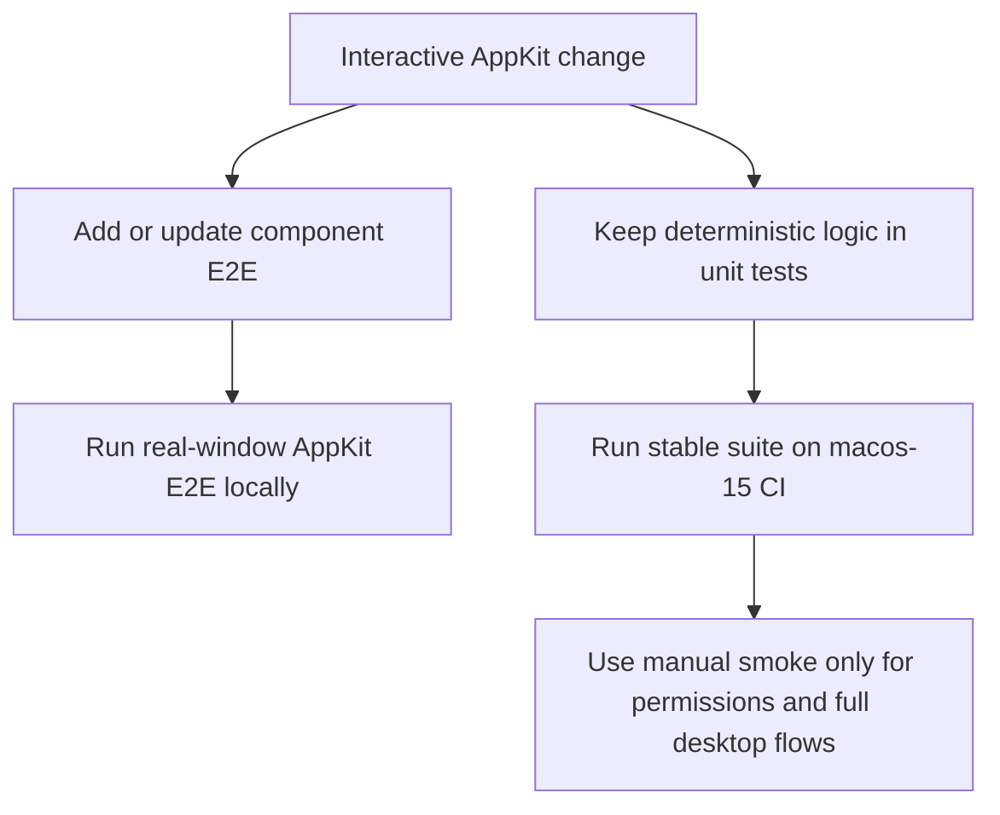

# Testing



Frame uses two automated test layers:

- `FrameCoreTests` cover deterministic helpers that do not need AppKit.
- `FrameAppTests` cover AppKit component behavior that is stable in a macOS test process.

## Component E2E

AppKit component E2E tests live in `Tests/FrameAppTests/` and use XCTest. They should exercise real controls and field editors inside a test window, but avoid full desktop automation, Screen Recording permission, and modal AppKit APIs.

New HUD or interactive AppKit features should add component E2E coverage for the user-visible cases they change:

- ordinary typing and deletion before commit
- intermediate invalid input states that should not beep or commit early
- commit behavior through Enter, blur, or control actions
- keyboard shortcuts such as Command-A when they are stable in a test window
- model refreshes while a field editor is active
- button or menu-trigger callbacks that must commit active input first
- locked-ratio or preset behavior at the component boundary when it does not require a modal menu
- recording HUD mode changes and callback routing that do not require Screen Recording permission
- scrolling screenshot live-preview sizing, non-overlapping placement,
  copy-free fixed-height rendering, overlaid status transitions, and cleanup
- incremental scrolling initialization, reliable append, no-motion detection,
  rejected-frame preservation, historical repetition, static footer handling,
  bounded fingerprints, canvas resource limits, and single final encoding
- closed-loop automatic scrolling: no next scroll before frame classification,
  three-sample bottom confirmation, historical-repeat stopping, unreliable-match
  pausing, a real detached default worker covering ingest and Finish without
  actor-isolation violations, and a default live path that never calls batch restitching
- scrolling overlap matching on sparse white-background pages where a small
  amount of meaningful content moves without exceeding whole-frame noise
- screenshot annotation canvas interactions for create, select, move, resize, delete, undo/redo, text re-editing, and rendered copy/download output

Do not call modal menu presentation such as `NSMenu.popUp` from CI tests. Prefer testing the callback seam or the control state before presentation; keep a manual smoke note for the actual popover/menu if needed.

## CI Expectations

GitHub Actions runs on a fixed `macos-15` runner and records the AppKit component E2E local-only requirement:

```sh
swift test --filter HUDSizeControlTests
swift test --filter ImageWorkspacePanelControllerTests
swift test --filter ScreenshotDragItemProviderTests
```

Run AppKit component E2E locally before shipping interactive HUD, workspace, preview, or drag changes. GitHub hosted macOS runners can crash or hang real `NSWindow`, `NSPanel`, and field-editor tests before assertions run, so hosted CI skips these suites and keeps the stable lower-level test/build/package path green.

Avoid `macos-latest` because it can silently move to newer hosted images. Keep the runner pinned to a Swift 6.1-capable macOS image and keep real AppKit window e2e local-only until a self-hosted runner or a stable UI automation environment is available.

The workflow also runs the rest of the verification sequence:

```sh
swift test --skip HUDSizeControlTests --skip ImageWorkspacePanelControllerTests --skip ScreenshotDragItemProviderTests
swift build
scripts/package-app.sh
```

Component E2E tests must remain deterministic without Screen Recording permission. Full screenshot capture, live ScreenCaptureKit recording, TCC prompts, HUD exclusion from captured output, full-screen selection recording, and multi-display manual checks stay in the local smoke test flow documented in `docs/development.md`.

## Feature Iteration Rule

When a new requirement changes an interactive AppKit behavior, update the matching component E2E tests in the same change. If the behavior cannot be automated safely, document the reason and add the smallest stable lower-level coverage instead.

---
*Last updated: 2026-07-21 | Reason: document incremental scrolling and closed-loop control coverage*
