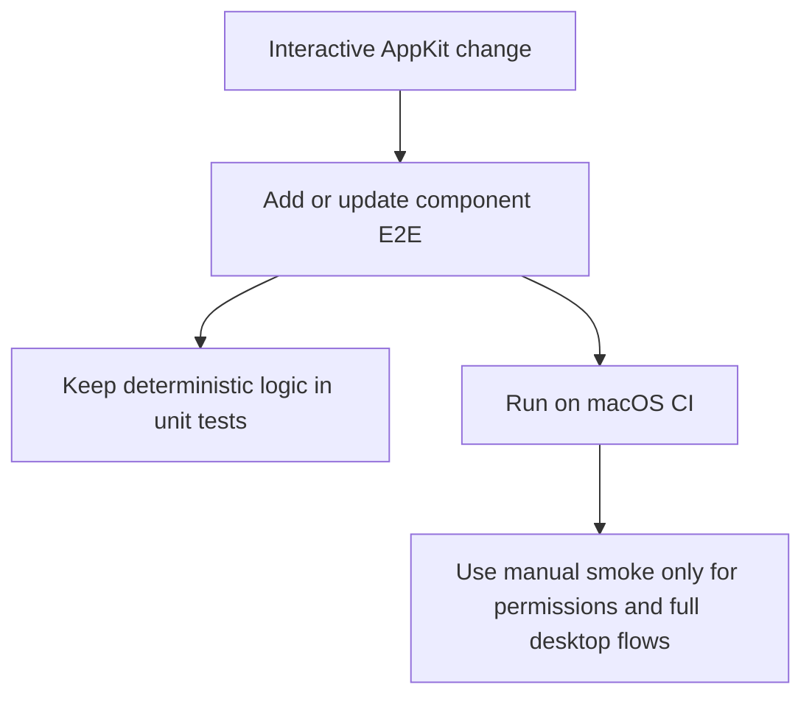

# Testing



Frame uses two automated test layers:

- `FrameCoreTests` cover deterministic helpers that do not need AppKit.
- `FrameAppTests` cover AppKit component behavior that is stable in a macOS test process.

## Component E2E

AppKit component E2E tests live in `Tests/FrameAppTests/`. They should exercise real controls and field editors inside a test window, but avoid full desktop automation, Screen Recording permission, and modal AppKit APIs.

New HUD or interactive AppKit features should add component E2E coverage for the user-visible cases they change:

- ordinary typing and deletion before commit
- intermediate invalid input states that should not beep or commit early
- commit behavior through Enter, blur, or control actions
- keyboard shortcuts such as Command-A when they are stable in a test window
- model refreshes while a field editor is active
- button or menu-trigger callbacks that must commit active input first
- locked-ratio or preset behavior at the component boundary when it does not require a modal menu

Do not call modal menu presentation such as `NSMenu.popUp` from CI tests. Prefer testing the callback seam or the control state before presentation; keep a manual smoke note for the actual popover/menu if needed.

## CI Expectations

GitHub Actions runs on macOS and includes an explicit AppKit component E2E step:

```sh
swift test list | grep '^FrameAppTests.HUDSizeControlTests/' | while read -r test; do
  swift test --filter "$test"
done
```

Run AppKit HUD component E2E tests one test case per `swift test` process. The hosted macOS runner can crash the AppKit test harness when all HUD window/editor tests share one process, so the full test step skips that suite after the isolated E2E step has covered it.

The workflow also runs the rest of the verification sequence:

```sh
swift test --skip HUDSizeControlTests
swift build
scripts/package-app.sh
```

Component E2E tests must remain deterministic without Screen Recording permission. Full screenshot capture, TCC prompts, and multi-display manual checks stay in the local smoke test flow documented in `docs/development.md`.

## Feature Iteration Rule

When a new requirement changes an interactive AppKit behavior, update the matching component E2E tests in the same change. If the behavior cannot be automated safely, document the reason and add the smallest stable lower-level coverage instead.

---
*Last updated: 2026-05-26 | Reason: document isolated HUD AppKit E2E execution in CI*
